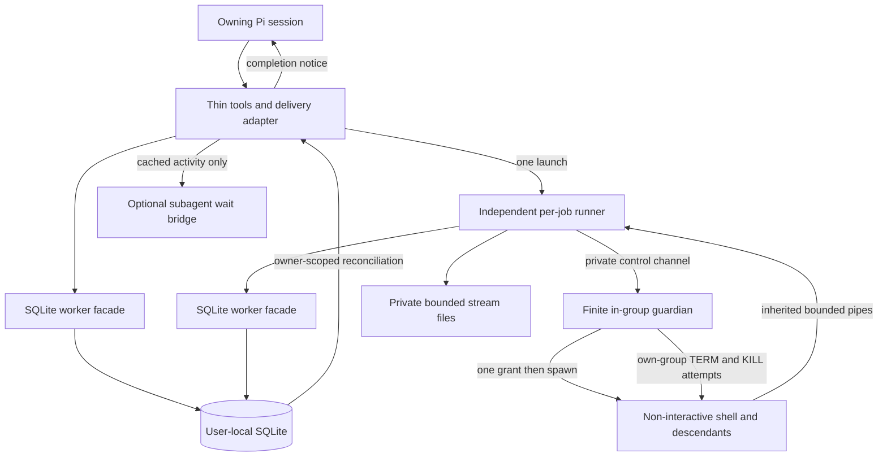
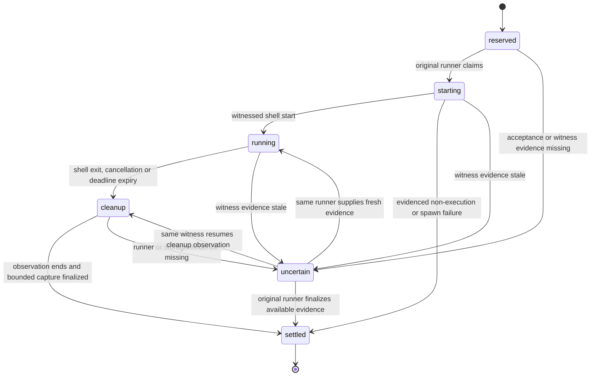

# pi-watch v0.1 Background Commands - Plan

## Goal Capsule

**Objective:** A Pi session can start a finite command, do other work or close Pi, and receive the command's result without repeatedly asking whether it has finished.

**Means:** Thin Pi adapter, SQLite storage and a finite runner/guardian pair per job (KTD1, KTD3, KTD6).

**Authority:** Product behavior is owned by the R-IDs; KTDs select mechanisms within those constraints. The user authorized planning, review and isolated throwaway lifecycle experiments, not production implementation, commits, pushes or publication. Historical research is supporting evidence, not a competing specification.

**Planning boundary:** The user selected cross-platform best-effort cleanup with separate shell and cleanup evidence. Final document review completed; its two mechanical corrections, three approved diagnostic/disclosure fixes and five explicitly settled design decisions are incorporated. Review history and decision receipts are under `docs/reviews/2026-09-09-best-effort-plan/`. The plan is implementation-ready, but neither readiness nor fixture success authorizes production implementation or implies its verification gates passed.

**Execution profile:** Once separately authorized, work test-first in the dependency order below. Unit IDs are local to this plan; the foundation execution ledger is a different workstream.

**Stop conditions:** Stop at the agreed slice boundary, on an unpatched runtime, or if real lifecycle evidence invalidates a requirement. Do not substitute another agent launcher, weaken ownership or add a daemon to make a test pass.

**Tail ownership:** The orchestrator verifies results and records progress separately under `docs/execution/`. The owner retains implementation and shipping approval. All described behavior remains unverified until its gates pass.

**Product Contract preservation:** R5 now explicitly preserves reservation-time acceptance and the crash-before-launch uncertainty window, as approved after final review. Changed R8-R10 and R14 by explicit user choice: deadline/cancellation initiate best-effort cleanup, known shell results remain separate, and descendant stop is not guaranteed. R12 retains Node 26/TypeScript/SQLite; ownership, request schemas, output limits and retention decisions remain unchanged. All R/A/F/AE/U identifiers are preserved; AE6 and AE7 reflect the approved weaker cleanup guarantee.

## Product Contract

### Summary

Build the full finite-command contract with a thin Pi adapter and independent per-job execution. Prove the command lifecycle before real Pi/subagent validation, then verify a packed installation; exclude adjacent orchestration features.

### Problem Frame

Waiting for a command ties up a Pi conversation, while repeated status questions spend model turns without advancing the work. Closing Pi or ending a child session also makes it easy to lose track of execution and its result.

### Key Decisions

- **Quit survival.** Governs R5, R6. (session-settled: user-directed — chosen over reload-only survival: work should continue after Pi closes.)
- **Owner-only access.** Governs R3, R4. (session-settled: user-directed — chosen over parent inspection or cancellation: child jobs remain the child's responsibility.)
- **macOS and Linux first.** Governs R11. (session-settled: user-directed — chosen over macOS-only or Windows-inclusive scope: validate both Unix platforms and defer Windows.)
- **Conservative recovery safeguards.** Governs R2, R7, R8, R9. (session-settled: user-approved — chosen over ephemeral ownership and silent retry-based recovery: uncertain work must remain visible without repeating command side effects.)
- **SQLite and TypeScript.** Governs R12. User-selected foundations; KTD1 selects the production binding.
- **Node 26 development.** Governs R12. (session-settled: user-directed — chosen over retaining the Node 24 development baseline: align development tooling and type definitions.)
- **Runtime narrowed to Node 26.** Governs R12. (session-settled: user-directed — chosen over Node 24.15+ plus Node 26: keep one runtime major aligned with development.)
- **Non-interactive shell boundary.** Governs R14. (session-settled: user-directed — chosen over an executable-and-arguments-only interface: cover ordinary finite shell jobs without terminal or service management.)
- **Public tool interface.** Governs R1-R4, R7-R10, R14, R15. (session-settled: user-approved — millisecond deadlines, replay rules, bounded pagination, separate byte offsets and closed owner-free requests selected during planning; cleanup responses now follow the subsequently approved best-effort rule.)
- **Shell exit starts cleanup.** Governs R8-R10, R14. (session-settled: user-directed — chosen over letting unawaited descendants finish naturally: work that must complete is awaited inside the command.)
- **Cross-platform best-effort cleanup.** Governs R8-R10, R14. (session-settled: user-directed — chosen over requiring confirmed containment with Linux-specific provisioning and unresolved macOS support: retain both platforms and TypeScript, expose shell results separately, and accept that descendants may survive and cleanup may remain unconfirmed even on ordinary runs.)
- **Deadline, output and retention defaults.** Governs R15, R16. (session-settled: user-approved — chosen over broader output capture and automatic expiry: keep each job bounded without automatic result loss.)

### Actors

- A1. **Owning session:** The persisted Pi session that starts a job, including a persisted subagent session.
- A2. **Other session:** Any different session, including the owner's parent, a fork or a replacement subagent.
- A3. **pi-watch:** The command execution and result-delivery capability; it does not perform model reasoning.

### Requirements

**Command access and ownership**

- R1. Start a finite command and promptly return a stable job identity without waiting for completion; the owner can list jobs, inspect status and retrieve bounded output.
- R2. Accept starts only from persisted sessions with recoverable ownership; reject an unsupported session before launching its command.
- R3. Restrict job listing, inspection, output, cancellation and completion notices to the originating session; reopening that same session preserves access.
- R4. Do not transfer jobs to a parent, fork or replacement session when a child exits; the parent receives only the child's normal subagent status and reports.

**Lifetime and results**

- R5. Preserve independent execution of launched jobs across extension reload and full Pi exit, subject to cancellation and deadlines; keep accepted job records and available results recoverable when the same owner returns. Acceptance does not guarantee shell launch: missing launch evidence remains explicit uncertainty, without command retry.
- R6. Deliver completion to an available owner without model-driven status polling; retain a pending notice while that owner is absent and deliver it when the owner returns.
- R7. Recovery may repeat a notice for the same job, but must never silently retry or restart its command.
- R8. Report the known root-shell outcome separately from descendant-cleanup certainty, preserving explicit unknowns for missing evidence; a shell exit code, signal-attempt record or finalized result must never imply all descendants stopped.

**Bounds and cancellation**

- R9. Apply finite deadlines even while Pi is absent by suppressing already-expired starts or initiating best-effort cleanup of launched commands, while enforcing bounded retained output and exposing limits and truncation; a deadline is not a guarantee every descendant dies.
- R10. Let the owner request cancellation and distinguish recorded intent, evidenced before-start suppression and post-start cleanup attempts; launched-command cleanup remains unconfirmed, independently of a known shell result.

**Compatibility and delivery quality**

- R11. Support macOS and Linux, with real Pi and governed pi-subagents lifecycle validation on both; declare the tested runtime and integration versions rather than claiming universal compatibility.
- R12. Implement in TypeScript with local SQLite persistence; v0.1 supports Node 26.x for both Pi runtime and development, with an actual linked-engine safety check before store creation.
- R13. Verify an actual packed extension in an isolated Pi installation before offering installation instructions; inspect the shipped files separately from extension loading.

**Approved operating defaults**

- R14. Execute non-interactive `/bin/sh` command strings in the resolved working directory with the launching environment and closed stdin; interactive programs and deliberate process-group escape are unsupported. Root-shell exit ends useful command-body work and initiates best-effort cleanup of remaining in-group descendants. Commands must await background work they need completed; ordinary descendants can still survive failed cleanup or supervisor loss, and finalized results do not promise their absence.
- R15. Default execution to 30 minutes, allowing a positive per-command deadline up to 24 hours, and retain the first 5 MiB separately for stdout and stderr while continuing to drain and discard overflow.
- R16. Do not automatically expire job results in v0.1; retention cleanup is deferred and documentation must disclose cumulative disk growth.

**Completion-latency disclosure:** The planned normal path finalizes results roughly six seconds after root-shell exit, plus scheduling/I/O overhead. This is a healthy-runtime design expectation pending production measurement, not a hard deadline. Documentation must make the delay visible for short commands.

### Key Flows

- F1. **Start and finish.** The persisted owner starts a command, receives its job identity, continues other work, then receives a completion notice and retrieves output. Covers R1, R2, R3, R6, R9.
- F2. **Leave and return.** The owner reloads or closes Pi during execution. The command continues under its limits, and the same owner later receives the pending result. Covers R3, R5, R6, R9.
- F3. **Subagent ownership.** A child starts a job and uses its result in its normal report. If the child exits first, its job and pending notice remain associated with that child, not its parent or a replacement. Covers R3, R4, R11.
- F4. **Cancellation or uncertain recovery.** The owner requests a stop, or returns after a failure. The reported outcome follows available evidence rather than assuming that a request or missing process proves completion. Covers R7, R8, R10.

```text
Owning session starts job -> command runs -> result retained
                                 |                 |
                       Pi closes or reloads        |
                                 |                 v
                       deadline still applies   owner available?
                                                yes -> notify owner
                                                no  -> keep pending
                                                       until owner returns
```

This illustrates F1 and F2; it is not a proposed internal state machine.

### Acceptance Examples

- AE1. **Covers R1, R2.** A long-running command returns a job identity before finishing. The same start from an ephemeral session is rejected without command side effects.
- AE2. **Covers R3, R4.** Another session, a parent and a fork cannot list, inspect or cancel the owner's job through pi-watch. Reopening the original session restores access; copied transcript text does not grant access.
- AE3. **Covers R5, R6, R11.** In separate real reload and full-exit tests on each supported OS, a command finishes while its owner is unavailable. Reopening that owner exposes its result and delivers the pending notice without a status-polling conversation.
- AE4. **Covers R6, R7.** A failure during notice delivery may cause a repeated notice with the same job identity after recovery. The command's externally observable side effect is not repeated by recovery.
- AE5. **Covers R7, R8.** A failure around command launch leaves insufficient evidence to establish its outcome. Recovery reports uncertainty and does not rerun the command or claim it never started.
- AE6. **Covers R9, R10.** With Pi closed, an overlong command triggers best-effort cleanup at its deadline and noisy output remains retention-bounded. The returning owner sees deadline/attempt evidence, any known shell outcome, unconfirmed cleanup and capture truncation or incompleteness.
- AE7. **Covers R8, R10.** Cancellation racing shell completion preserves the known shell outcome and separate request/cleanup evidence. Before-start suppression can be confirmed; a launched-command request, shell exit or escalation marker never confirms descendant stop.
- AE8. **Covers R3, R4, R11.** A governed subagent can consume its own completion and include it in its normal report. If it exits first, neither its parent nor a replacement receives separate pi-watch output or acquires its jobs.
- AE9. **Covers R11, R13.** A clean, isolated Pi installation loads the packed extension and exercises start, completion and result retrieval using the declared runtime matrix, without developer-local sessions or unrelated extensions.

### Scope Boundaries

- Finite local commands only: no permanent daemon, scheduler, PostgreSQL backend, generic orchestration framework or second reasoning runtime.
- No Windows support in v0.1, and no promise that running jobs survive machine reboot, host loss or sandbox destruction.
- No exactly-once notice-delivery claim, automatic command recovery by re-execution, or automatic job adoption; R4, R7 and R8 govern the alternatives.
- Owner scoping is a pi-watch access rule, not filesystem or transcript secrecy from the same OS user.
- No package publication, remote security changes or implicit permission expansion is authorized by this contract.

### Dependencies and Assumptions

- Persistence assumes a healthy local filesystem. Network storage and recovery after storage loss are outside this iteration.
- Completion delivery requires the original owner to return in a compatible Pi environment. This contract does not require resurrecting an absent child or starting an agent to consume its result.
- Real lifecycle tests, not detached-process fixtures alone, must establish R5 and R11. If Pi or subagent lifecycle constraints prevent them, return the conflict for a product decision rather than weaken the requirement silently.
- Command execution must respect configured host tool controls. Planning must establish watch-specific authorization behavior rather than assume that rules for the built-in bash tool automatically cover another spawning tool.

---

## Planning Contract

### Key Technical Decisions

- KTD1. **Built-in SQLite, isolated from control timers.** Use `node:sqlite` without a native binding dependency. Before opening disk state, require Node 26.x and linked SQLite at least 3.51.3; unsupported runtime is a preflight rejection, not an unknown command outcome. Run synchronous DB work through a small worker-thread facade in both the Pi adapter and runner so lock waits do not block Pi or deadline/output handling. Governs R9, R12; Node's synchronous API and patched engine floor motivate the isolation.
- KTD2. **Durable UUID ownership, separate wait identity.** Take the owner UUID from trusted SessionManager context, never tool arguments or environment. Before start, verify an existing readable session file whose header UUID matches; a persistence flag or filename alone is insufficient. Store the session path as recovery metadata and use the current trusted path only for the subagent wait adapter. Every store operation predicates on owner UUID; a moved file with the same valid header remains the same owner, while a fork's new UUID does not. Governs R2-R4.
- KTD3. **One independent runner and one finite guardian per job.** Launch the compiled runner with the current Node executable, detached without Pi-connected stdio or required Pi IPC. It owns SQLite publication and command-output read ends. It launches a detached guardian in a distinct process group over a private control channel; the guardian owns the shell and live cleanup timers (KTD6). Keep control metadata separate from stdout/stderr. Retain each launch handle through spawn/error acknowledgment, then unreference it where appropriate; adapter disposal never stops these actors. Capture the launching environment in memory only. Governs R5, R9, R10, R14; this is not a second agent runtime.
- KTD4. **Reserve once; never recover by spawning again.** Generate a job UUID before persistence and uniquely reserve `(owner UUID, request key)`. Default the key to the trusted tool-call ID; allow an explicit request key for caller-controlled replay. Same key and normalized inputs returns the existing job, conflicting inputs fail, and a new key is a new invocation. Only the reservation creator may launch a runner; only its one-time runner claim may launch the shell. Reopening or retrying metadata operations never launches a replacement. Governs R1, R7, R8.
- KTD5. **Finalize evidence, not a claim of group death.** Store launch phase, runner claim, deadline, cancellation intent, shell outcome, cleanup observations, capture state and result revision separately. `settled` means the available result and bounded capture have been finalized, not that descendants stopped. Before-start suppression or definitive spawn failure can establish that the command did not run; uncertain launch cannot. For launched commands, retain known root code/signal with cleanup `unconfirmed`, or an unknown shell outcome when its receipt is missing. Stale witnesses never grant spawn/signal authority. The original runner may refine unknown evidence without replacing an already-known shell outcome; each durable revision carries its own pending notice. Governs R7, R8, R10.
- KTD6. **Only the live in-group guardian attempts cleanup.** Preserve the approved cancellation-first pre-spawn checkpoint after the original runner claim; failure grants no shell-start authority. The guardian cannot spawn until it receives the runner's one-time grant over their original control channel. After release, root exit, cancellation, deadline or runner-channel loss initiates the own-group protocol below; none grants zero-side-effect or all-stop guarantees. The guardian never signals an external numeric group and no actor recovers signals from recorded identifiers. (session-settled: user-approved — before-start suppression and cancellation-first precedence remain as selected during document review.) Governs R8-R10, R14 under the subsequently approved best-effort product decision.
- KTD7. **Short transactions and durable evidence.** Use one user-local database, WAL, `synchronous=FULL`, foreign keys and schema versioning on each connection. Use short write transactions and a 1,000 ms busy timeout; bounded metadata retries may repeat only idempotent operations, never an OS spawn. Serialize first schema creation with a write transaction: validate existing state, create all required objects and record the schema version atomically, rolling back on failure. Every accepted version must denote a complete validated schema. Store unavailable is distinct from job failed. Refuse newer schemas without modifying them; do not migrate historical spike stores. Governs R5, R7-R9, R12.
- KTD8. **Bound capture without waiting for surviving writers.** Keep private stream files outside repositories and apply R15 with byte counts, bounded queues and overflow draining. Start a 1,000 ms monotonic capture-cutover interval when guardian exit/loss is observed or the cleanup observation budget ends; do not wait for EOF or a child `close` event. At cutover stop intake, close read endpoints, finish bounded queued writes and flush the retained prefix before result publication. Mark open-at-cutover, partial or unavailable capture explicitly; I/O failure cannot become complete output. Closing read ends can expose surviving writers to EPIPE/SIGPIPE and is not cleanup proof. Governs R1, R9, R15, R16; the Public Tool Contract owns display/pagination bounds.
- KTD9. **Durable notice state, fenced publishers.** The runner commits a result revision and pending notice atomically. Owner reconciliation may commit an uncertain revision under the stale-witness protocol below, without acquiring execution authority; competing writers use conditional transactions and cannot overwrite known shell evidence. An available adapter reconciles its owner on activation and at a one-second interval while attached, including after an unknown observation; this is local polling, not model polling. A renewable 15-second SQLite delivery lease scoped to each owner/job coordinates duplicate live owners. Dispatch the lowest unacknowledged revision first, with at most one in-flight enqueue per job per activation; do not advance to the next revision until matching transcript persistence is acknowledged. Renew while awaiting persistence and release on shutdown or generation change. Recheck lease ownership, activation generation and revision eligibility before enqueue. A paused former publisher or already queued message can still arrive late after lease expiry: ordering applies to normal dispatch, not an absolute cross-process delivery guarantee. Send a structured Pi custom message as a follow-up with a turn trigger. Do not acknowledge on enqueue or `message_end`; acknowledge only after a matching owner/job/revision message is read from the persisted session file. Lease expiry, reload and crash may replay that same notice. Fence callbacks by activation generation and recheck current ownership before sending. Use an idempotent activation disposer to clear timers, fence pending callbacks, release delivery leases, close the store client and terminate its SQLite worker without stopping the independent runner. Cleanup must be bounded; if storage is unavailable, rely on lease expiry rather than pinning shutdown. Governs R3, R6, R7.
- KTD10. **Minimal optional wait bridge, not result transport.** Implement only the documented version-1 process-global background-work registry contract, without importing pi-subagents' agent runtime or relying on sibling-package resolution. Validate its version/shape and bounds; incompatible state disables the bridge with an explicit diagnostic, never overwrites another provider. One process-global pi-watch provider routes session-file wait identities to owner-scoped cached activity; its synchronous callbacks never query SQLite. Reload disposers remove only their own activation. A finalized result or explicit uncertain observation clears active waiting; this means no more supported result-waiting, not that all OS processes stopped. Pi-watch alone publishes result notices. Governs R3, R4, R6, R11.
- KTD11. **Five primitive tools, host interception intact.** Expose `watch_start`, `watch_list`, `watch_status`, `watch_output`, and `watch_cancel`. The Public Tool Contract below fixes request fields, validation and pagination. Start accepts command, optional cwd/deadline/request key; resolve relative cwd against the trusted current cwd before reservation. The other tools accept job IDs or bounded pagination, never an owner override or arbitrary log path. Pass calls through normal Pi tool registration/interception, propagate denials before reservation/spawn, and do not modify host allowlists or pretend bash-specific rules cover watch tools. Integration documentation requires explicit watch-tool authorization in restrictive hosts. Governs R1-R4, R10, R14.
- KTD12. **Build JavaScript, keep Pi host-supplied.** Compile TypeScript into ESM under `dist/` with the pinned compiler and rewritten relative import extensions. The adapter, DB worker, detached runner and guardian are distinct entry files; runner/guardian code imports no Pi runtime and no native helper is shipped. Declare actual Pi core and shared `typebox` imports as wildcard peers and pin exact development fixtures. Keep `private: true` and version `0.0.0` throughout this plan; release-policy rejection remains intentional even after the packed extension loads. Governs R11-R13.

### Guardian Control and Result Boundaries

This protocol instantiates KTD3-KTD6 and KTD8; it is an implementation plan, not promotion of the throwaway fixture.

1. The runner observes guardian spawn/error and a bounded readiness handshake before granting shell execution. The guardian verifies that its own PGID equals its live PID and differs from the runner's group using a direct, fixed-argument system `ps` probe with a one-second timeout and 4 KiB output cap. Missing/invalid topology fails closed before shell launch; observations are never signal targets. The guardian refuses startup without its original private runner channel.
2. Only the reservation creator launches the runner. Only that runner's original claim plus successful pre-spawn checkpoint can issue one shell-start grant. Duplicate grants, reconnects and recovered records cannot start another shell. If the runner disappears before a grant, the guardian exits without a shell; ambiguous grant/spawn acknowledgment remains unknown.
3. The guardian installs its TERM handler before launching the non-detached shell. Shell stdout/stderr inherit the pipes read by the runner; bounded control-channel messages carry shell spawn/exit and cleanup receipts, never command-output text. The runner persists received facts through its SQLite worker; guardian markers/files are not a second production store.
4. The guardian arms an immutable local deadline before shell release and does not depend on SQLite or Pi to enforce the attempt. Root exit, a live cancellation message, deadline expiry or runner-channel loss starts cleanup once. It attempts TERM with `process.kill(0, "SIGTERM")`, where PID argument zero selects its own group, and starts the five-second monotonic grace after that call returns or throws. At grace expiry it attempts own-group KILL even if the root exited during grace. Record TERM return/error literally and pre-KILL intent as intent only; guardian SIGKILL cannot supply a post-call receipt.
5. Both actors know the immutable deadline. The runner starts a seven-second cleanup observation budget at the first cleanup trigger it observes (five-second grace plus two seconds for observation); its own deadline timer also starts that budget if guardian messages are lost. Guardian exit/loss ends observation earlier. KTD8 then bounds capture before publication, even if an ordinary descendant still holds a pipe. These are healthy-runtime timing targets, not guarantees through filesystem/kernel stalls. The normal shell-exit path consequently adds about six seconds before result finalization, plus scheduling/I/O overhead.
6. Runner loss leaves durable evidence potentially unknown; a live guardian attempts cleanup on channel loss or its local deadline and terminates. Guardian loss leaves any surviving shell/descendants without further signal recovery. Each control actor must have a finite shutdown path; storage retries and output errors cannot create a permanent watcher. Late evidence received by the original runner may improve an unknown observation before it exits, but recovery never relaunches a control actor or command.

**Shell command handoff:** Launch the fixed system `/bin/sh` with an argument array containing `-c` and the exact validated command string, with stdin closed and no PTY. Do not add an intermediate shell or persist an extra script file. Command text may be visible to OS process inspection and monitoring; private database/output permissions and owner-scoped tools do not provide argv secrecy. Documentation warns against embedding secrets in command strings and makes clear that inherited environment and command-created child arguments also remain subject to OS access controls. Extension diagnostics still obey the separate redaction rule. (session-settled: user-directed — conventional shell command-line execution with explicit exposure warning selected over a private script-file handoff.)

**Cancellation delivery:** After shell release, the live runner checks durable owner-scoped cancellation intent through its SQLite worker on a one-second cadence, with at most one read in flight and no accumulated read backlog. Forward a newly observed intent once over the original guardian channel. Read failures leave intent pending and retry on later ticks without blocking the guardian's independent deadline. Channel/send failure is not a cleanup receipt: retain uncertainty about delivery and follow the existing cleanup-observation state rules, never reconnect or replace an actor. Checks stop at result finalization; in-flight callbacks are fenced against changing finalized evidence. The pre-spawn checkpoint remains separate and cancellation-first. One second is a healthy-runtime detection target, not a hard bound through storage/scheduling failure. (session-settled: user-directed — one-second SQLite checks selected over an additional push endpoint.)

**Stale-witness recovery:** The original runner advances a durable heartbeat counter approximately once per second through its SQLite worker, with at most one heartbeat write in flight. Owner reconciliation tracks the observed claim identity/counter using a local monotonic clock, starting a fresh window on activation. After 15 seconds of successful reads without progress, including an unclaimed reservation with no heartbeat, it may conditionally commit an uncertain revision and pending notice in one transaction. Recheck the expected claim/counter and non-finalized state inside that transaction; a concurrent heartbeat, result or another reconciliation winner defeats the stale write. Emit at most one stale revision for the same observed claim/counter. Failed reads reset the observation window rather than establish staleness; persisted wall-clock timestamps do not drive this decision.

Uncertainty means missing progress evidence, not dead processes, before-start suppression or finalized output. Preserve any known shell/capture facts and mark remaining evidence unknown. The optional wait bridge clears on this observation even though work may survive. A resumed, fenced original runner can restore fresh activity or publish later facts without replacing a known shell outcome; its heartbeat/receipt path never issues a new launch grant. Recovery never spawns a replacement or signals recorded IDs. Storage failure can delay diagnosis and durable notice creation; expose store unavailability rather than claim an uncertain revision committed. (session-settled: user-directed — one-second heartbeat and 15-second local observation selected; transient uncertainty after suspension and the post-reopen observation delay are accepted.)

System `sh` and `ps` are preflight prerequisites, not downloaded dependencies. Resolve fixed system utility paths for each supported OS and reject missing utilities without launching the command. No process-table sweep or group-existence probe is used as execution authority.

### Public Tool Contract

This interface implements KTD4, KTD5, KTD8 and KTD11. Request fields and pagination remain approved and unchanged; result semantics now follow R8-R10's explicitly approved best-effort boundary.

| Tool | Closed request object |
| --- | --- |
| `watch_start` | Required `command`; optional `cwd`, `deadlineMs`, `requestKey` |
| `watch_list` | Optional `limit`, `cursor` |
| `watch_status` | Required `jobId` |
| `watch_output` | Required `jobId`, `stream`; optional `offsetBytes` |
| `watch_cancel` | Required `jobId` |

Reject unknown properties. No request accepts an owner/session identity, environment map, shell selector, arbitrary output/store path, signal override or PTY. Trusted context supplies ownership. Job IDs are generated lowercase UUIDs; invalid IDs reject as invalid arguments, while well-formed foreign and missing IDs both return `NOT_FOUND`.

**Start and replay:** `command` and any supplied `cwd` must be nonempty, NUL-free, well-formed Unicode strings. Compare command text exactly, without trimming or Unicode normalization. Resolve omitted/relative cwd lexically against the trusted current cwd; compare that absolute path string without using filesystem realpath as an idempotency key. A missing cwd remains an evidenced spawn-failure case rather than a reason to change invocation identity.

`deadlineMs` is an integer duration from 1 through 86,400,000, defaulting to 1,800,000. Sample `acceptedAt` within the successful reservation transaction and persist `deadlineAt = acceptedAt + deadlineMs` in that transaction. This is not an assertion that an exact commit instant can be stored in advance. Lock/launch delay consumes the duration; an expired pre-spawn checkpoint does not start the command. Return UTC timestamps and the effective limits. Reuse preserves the original timestamps and deadline. Live enforcement uses an elapsed timer from the remaining duration; wall-clock disturbance and scheduling stalls do not acquire a hard real-time guarantee.

An explicit `requestKey` is 1–128 ASCII characters matching `[A-Za-z0-9][A-Za-z0-9._:-]*`, without trimming or case folding. Separate explicit-key and trusted-tool-call-key namespaces. Same owner/key plus exact command, lexical absolute cwd and effective deadline returns the existing job; different compared inputs return `REQUEST_KEY_CONFLICT`. Environment is captured only for the authorized launch, never persisted or compared: a changed environment with matching inputs still reuses the existing job. Return whether the reservation was created or reused. Accepted means a durable reservation exists, not that the shell started. Pi can exit after reservation but before runner launch; that accepted record may never execute. Reconciliation reports missing progress as uncertainty under the stale-witness rule, not as proven non-execution, and never launches a replacement. Ambiguous acceptance returns the preallocated job ID and explicit uncertainty; no response grants automatic command replay. (session-settled: user-directed — preserve reservation-time acceptance and disclose the gap rather than require a runner claim before successful acceptance or add an expiring launch gate.)

**Lists:** `limit` is an integer from 1 to 100, defaulting to 20. Return fewer records if necessary to remain within the rendered-response cap. Order by a durable transaction-assigned creation ordinal, descending, not wall-clock time. The first page captures a maximum ordinal; continuation selects that snapshot's remaining lower ordinals. Concurrent inserts are excluded until a fresh traversal; status fields remain current on each page. Return `jobs` and `nextCursor`, with null when exhausted. Cursors are opaque versioned base64url strings of at most 512 ASCII characters carrying the snapshot and continuation ordinals; malformed or unsupported cursors return `CURSOR_INVALID`. Cursors grant no authority: every query still predicates on the trusted owner. Do not persist cursor records.

**Output:** `stream` is exactly `stdout` or `stderr`; their offsets are independent, with no reconstructed interleaving. `offsetBytes` is a zero-based integer offset into retained raw bytes, default 0, maximum 5,242,880. An offset beyond the currently retained end returns `OFFSET_OUT_OF_RANGE`; an offset at that end returns empty text. Return the selected stream, input and next raw-byte offsets, retained byte count, whether further bytes exist in the current snapshot, whether capture can still grow, capture availability, retention-truncation, incomplete and open-at-cutover flags. Being caught up does not mean the command finished. Captured-prefix closure is separate from process completion: reaching the retention cap, capture failure or stream closure can prevent further growth while the command remains active.

Decode UTF-8 with replacement. Do not split complete valid scalars at server-selected page boundaries. A caller-supplied mid-sequence offset may begin with replacement text. Leave an incomplete trailing sequence unconsumed only while the retained prefix can still grow; once capture closes, consume it as replacement rather than stranding the cursor. Preserve LF and horizontal tab, render CR visibly as `\\r`, and escape other C0 controls, DEL and C1 controls as lowercase `\\xhh`. ESC is displayed as `\\x1b`, never emitted as a terminal command. This is sanitized text, not a reversible raw download.

Bound the complete extension-produced response to 51,200 UTF-8 bytes after replacement, sanitization, metadata and extension serialization. Host-added framing is outside this bound. Output text is additionally limited to 2,000 logical lines: each LF-terminated record plus one nonempty trailing suffix; empty text has zero lines. Select a raw prefix within both limits and return a resumable next offset. Sanitizer/serialization expansion counts toward the byte cap. Page boundaries are not retention truncation; partial/unavailable capture is also distinct from command outcome.

**Responses and cancellation:** Use a version-1 success/error envelope with `schemaVersion`, `ok`, and either `data` or an error code/message. Distinguish invalid input, unsupported runtime/owner, unavailable storage, missing job, replay conflict, invalid cursor and invalid offset. Host policy may deny a call before this envelope exists. Bound all responses, including errors. Metadata responses and notices omit raw command text, cwd, environment, private paths and command output.

Status exposes job identity, observation phase, acceptance/deadline timestamps, limits, result revision, cancellation intent, result finalization, shell outcome, cleanup state and per-stream capture state. A known shell outcome contains its exit code or terminating signal; missing shell evidence is explicitly unknown. There is no aggregate all-process success/stop field. Cleanup is `not_required` only when command non-execution is established, `not_requested` before a live cleanup trigger, `pending` while attempts are observed, and `unconfirmed` when launched-group observation ends. A known shell exit zero may coexist with `unconfirmed` cleanup and incomplete output. Tool-envelope `ok` reports tool-call success, not command success.

Cancellation returns promptly with newly recorded, already recorded or already-terminal disposition. Only evidenced before-start suppression confirms cancellation without command execution. After launch, cancellation is pending or unconfirmed; shell exit and TERM/KILL observations do not confirm descendant stop. A competing known shell outcome is retained. Already-terminal means the result was finalized, not that survivors are absent: no new intent, recovery signal or retry is created for that record. Notices carry job/revision, known shell outcome or explicit unknown, cleanup certainty and capture flags without unsolicited raw output. Repeated delivery preserves notice identity. Notices explicitly identify their result revision as a snapshot; a lower revision than one already seen is a stale replay, not a job-state regression. `watch_status` returns the latest durable evidence and remains authoritative. Retain pending earlier revisions instead of superseding them; blocked persistence can delay newer notices. (session-settled: user-directed — ordered per-job delivery with explicit stale-replay handling selected over latest-only supersession; no exactly-once or absolute delivery-order guarantee.)

### High-Level Technical Design

The boundaries below implement KTD1-KTD12. SQLite is the authority for job evidence; the Pi transcript is evidence of notice persistence, not execution authority.



```mermaid
sequenceDiagram
    participant O as Owner
    participant A as Adapter
    participant D as SQLite
    participant R as Runner
    participant G as Guardian
    participant P as Pi transcript
    O->>A: Start through host tool policy
    A->>D: Reserve owner and request key
    A->>R: Launch once with claim identity
    A-->>O: Job ID and observed launch state
    R->>D: Claim execution before shell spawn
    R->>G: Launch detached guardian; await readiness
    Note over R: Check cancellation and deadline; suppress shell grant if already stopped
    R->>G: One-time shell-start grant
    G-->>R: Shell observations and cleanup attempts
    Note over G: Own-group cleanup on shell exit, cancellation, deadline expiry or runner loss
    Note over R: Bounded observation and capture cutover, independent of EOF
    R->>D: Commit separate shell/cleanup/capture evidence and pending notice
    A->>D: Claim per-job lease for lowest unacknowledged revision
    A->>P: Enqueue owner follow-up
    A->>P: Read persisted matching notice
    A->>D: Acknowledge observed persistence
```

Crash boundaries in the sequence do not create new launch authority (KTD4). Failure before a reservation commits is a definite rejection only when that fact is established; otherwise return the preallocated ID and uncertain acceptance, allowing keyed lookup without replay.



`uncertain` means the durable observation is incomplete; it is not a restartable queue. `settled` means a result record was finalized and can be delivered, including known shell status with unconfirmed cleanup. Neither state proves descendant absence. Deadline reached, cancellation requested, shell code/signal, cleanup certainty and capture completeness are independent facts; do not collapse post-start deadline attempts into a `timed_out` stop claim (KTD5, KTD6).

**Stored objects:** Jobs hold owner/request identity, normalized command/cwd, timestamps, immutable limits and execution evidence. Notices hold owner/job/result revision plus delivery lease and persisted-observation state. Output paths are derived from validated generated IDs. Include a durable creation ordinal for stable list membership/order. Schema details are private implementation, not a generic backend API.

**Data lifecycle:** Resolve `watch/v1/jobs.sqlite` and `watch/v1/jobs/<job-id>/` beneath the public Pi agent-directory helper, never beneath cwd. Create directories with mode 0700 and database/output files with mode 0600; preserve private sidecar permissions without changing Pi's process-wide umask. Reject unsafe path/type/symlink conditions before use. Session checks and transcript reads run outside Pi's UI thread where practical. Do not store environment snapshots; command text and output may still contain secrets and remain local. Removal of working directories, the store, or package files while a job runs is not transparent migration or recovery.

**Diagnostics boundary:** Extension-produced logs and diagnostics use stable error codes and explicitly allowlisted non-sensitive fields. Never serialize raw errors, causes or stacks without filtering: command text, cwd, environment values, output bytes, owner/session paths and private store paths must not escape into diagnostics. This applies to storage, spawn, output, tool, delivery and optional-bridge failures; private file modes do not protect host logs. U1-U4 inject synthetic secret markers and assert their absence from captured diagnostics.

**First proof boundary:** The core runner lifecycle is testable without Pi. The Pi adapter then exercises actual session behavior; the optional bridge finally exercises governed wait-and-consume and early child exit. A mocked response stream may make an SDK test deterministic but does not count as a real governed-child run.

### Research and Alternatives

- Follow the pure-policy/thin-wrapper split in `scripts/package-policy.ts` and `scripts/check-package.ts`, plus observable subprocess assertions in `tests/package-cli.test.ts`. These are organizational patterns, not lifecycle proof.
- [Node 26 SQLite API](https://nodejs.org/docs/latest-v26.x/api/sqlite.html) says DatabaseSync APIs execute synchronously. This motivates KTD1 rather than blocking Pi's event loop during contention.
- [Node v26.0.0 bundled engine](https://github.com/nodejs/node/blob/v26.0.0/deps/sqlite/sqlite3.h) identifies SQLite 3.51.3. [SQLite WAL documentation](https://sqlite.org/wal.html) identifies 3.51.3 as fixing the WAL-reset bug. KTD1 checks the actual engine rather than trusting a Node label.
- [SQLite synchronous settings](https://sqlite.org/pragma.html#pragma_synchronous) and [busy handling](https://sqlite.org/c3ref/busy_timeout.html) motivate KTD7. WAL has one writer and bounded lock waiting is not a success guarantee; FULL is not a guarantee against failed hardware.
- [Node detached-process documentation](https://nodejs.org/docs/latest-v26.x/api/child_process.html#optionsdetached) motivates KTD3. It does not establish survival of Pi's own shutdown paths or safe signaling of reused identifiers.
- [Pi extension API](https://github.com/earendil-works/pi/blob/main/packages/coding-agent/docs/extensions.md), [session implementation](https://github.com/earendil-works/pi/blob/main/packages/coding-agent/src/core/session-manager.ts) and [package contract](https://github.com/earendil-works/pi/blob/main/packages/coding-agent/docs/packages.md) guide KTD2, KTD9 and KTD12. Initial fixture targets are Pi 0.85.1 and `typebox` 1.3.7; upstream main is navigation, not a pinned compatibility promise.
- [pi-subagents integration contract](https://github.com/nicobailon/pi-subagents/blob/main/docs/extension-api.md) and [background-work leaf](https://github.com/nicobailon/pi-subagents/blob/main/src/api/background-work.ts) guide KTD10, initially against 0.66.0. The bridge is process-local, synchronous and limited to identities; it does not certify child lifetime or delivery.
- [POSIX kill semantics](https://pubs.opengroup.org/onlinepubs/9799919799/functions/kill.html) makes group-signal return insufficient evidence of all-member stop. KTD6 uses the guardian's own group to avoid external numeric-ID targeting and retains unconfirmed cleanup under R8-R10.
- [Node 26.7.0/libuv child reaping](https://github.com/nodejs/node/blob/v26.7.0/deps/uv/src/unix/process.c) consumes child status before exit callbacks. JavaScript child-state fields are not a stable group-identity handle; no such guard authorizes signals here.
- A native `WNOWAIT` helper could retain a group leader's identity but would not prove all-stop. [Linux cgroup v2](https://github.com/torvalds/linux/blob/v6.12/Documentation/admin-guide/cgroup-v2.rst) offers stronger contained-set evidence with provisioning and platform costs. The user selected cross-platform best-effort instead; neither mechanism belongs in v0.1.
- A native SQLite binding would add binary/installation coverage without a required capability here. A permanent writer service contradicts scope. Pi-owned execution cannot maintain deadline attempts after Pi exits. Raw recorded-PID cancellation cannot substitute for the live guardian. These alternatives are rejected for this iteration.

### Risks and Deferred Execution Questions

- **Required runtime proof, not a planning blocker:** Pi 0.85.1 and pi-subagents 0.66.0 are initial exact test targets, not advertised supported versions until U5 passes. Test explicit child wait-and-consume separately from early final text and forced disposal. If the supported public lifecycle cannot satisfy the contract, stop and seek an upstream/product decision.
- **Delivery durability:** Pi message enqueue and session append do not form a cross-store transaction. KTD9 tolerates replay; a transcript write lost after acknowledgment is not covered by a power-loss guarantee. Concurrent writes by two Pi processes to the same session file remain a host limitation, not something the delivery lease repairs.
- **Best-effort is not containment:** Guardian or runner loss, permission changes and ordinary surviving descendants can leave work alive after a result is finalized. U2 and U5 must expose that limitation rather than infer death from shell status, pipe EOF, a signal return or an armed marker. Clearing the wait bridge does not stop those processes. Recovery never signals saved IDs.
- **Storage failure:** Disk-full, permissions and I/O errors may prevent durable final evidence. Bound in-memory retries, stop accepting new jobs on storage failure, and preserve honest unknown/output-unavailable states on recovery; never delete evidence to free space automatically.
- **Total storage:** R15 bounds each job, not the number of jobs. R16 deliberately permits cumulative growth. Document this and do not promise quotas, automatic cleanup or sustained-load capacity.
- **Integration packaging:** Test the bridge against the actual consumer with independent module loading. Do not transplant Jiti spike loaders or absolute installation paths into product code. Unsupported registry versions fail explicitly without damaging other providers.
- **Deferred to execution:** Final private schema/helper names, filesystem-specific failure injection and observed OS support details follow the named tests. Any result that changes R1-R16 returns for approval, rather than being labeled a harmless implementation detail.

---

## Implementation Units

Units are dependency-ordered implementation scopes, not authorization to start. Their scopes below are the proposed independently reviewable slices; if one needs splitting, retain its U-ID and assign stable work-item IDs in the separate execution ledger before editing code.

### U1. Runtime, ownership and durable job records

- **Goal:** Establish safe, owner-scoped persistent evidence without launching commands.
- **Requirements:** R2-R4, R7, R8, R12; A1, A2; AE1, AE2, AE5.
- **Dependencies:** Existing foundation tooling only.
- **Files:** `src/owner.ts`, `src/job-store.ts`, `src/store-worker.ts`, `src/store-client.ts`, `src/job-types.ts`, `tsconfig.json`, `tests/owner.test.ts`, `tests/job-store.test.ts`, `tests/store-worker.test.ts`, `tests/fixtures/store-actor.ts`.
- **Approach:** Implement KTD1, KTD2, KTD4, KTD5 and KTD7 behind a small asynchronous store interface. Extend type checking to production source. Keep experimental databases and source out of this migration path.
- **Patterns:** Pure validation plus isolated side effects, as in the package-policy modules.
- **Test scenarios:**
  1. Covers AE1, AE2. Missing, ephemeral, malformed or header-mismatched session backing rejects; reopening the matching UUID succeeds and fork/foreign owners remain hidden.
  2. Same owner/key/input returns one reservation across independent processes; conflicting parameters reject and a different owner/key remains independent.
  3. Twenty concurrent storage actors preserve unique reservations and conditional final writes; a held writer returns bounded unavailable/busy without fabricated job failure.
  4. Killing a fixture writer before commit preserves old state; killing after commit preserves new state on reopen, without manual stale-lock stealing.
  5. Unsupported Node/engine and newer schema refuse safely; worker failure rejects pending requests without freezing the parent event loop.
  6. Concurrent first opens and interruption during bootstrap expose either no committed schema or one complete validated schema on reopen, never partial version/object state.
  7. Inject SQLite full/I/O failures at reservation, runner claim/heartbeat and final-result/pending-notice commit. Reopen after each failure: complete evidence commits or rolls back; no terminal result lacks its pending notice, no job failure is fabricated, and no recovery grants new launch authority.
  8. Under permissive fixture settings, verify private directory, database and sidecar modes. Preseed symlinks and wrong-type components; reject safely without creating or modifying an external target.
  9. Verify request-key syntax/namespaces, exact command comparison, lexical cwd normalization, equivalent default deadlines, unchanged replay timestamps and environment-independent reuse. Invalid input rejects before reservation; conflicting compared inputs never authorize launch.
  10. Inject synthetic secrets into storage/owner/worker failure inputs and errors; diagnostics expose only allowlisted non-sensitive fields, never raw error content or private paths.
  11. Conditional stale-witness publication atomically pairs one uncertain revision with its notice. Concurrent heartbeat, claim, final result or duplicate reconciler defeats a stale write; missing heartbeat cannot establish non-execution or overwrite known shell/capture evidence.
- **Verification:** Durable ownership, idempotency and worker isolation pass real persistence/process tests. No command-execution or delivery claim is earned yet.

### U2. Independent bounded command lifecycle

- **Goal:** Execute and retain one complete real command lifecycle independently of its launcher.
- **Requirements:** R1, R5, R7-R10, R14-R16; F4; AE1, AE4-AE7.
- **Dependencies:** U1.
- **Files:** `src/launch.ts`, `src/runner.ts`, `src/guardian.ts`, `src/guardian-protocol.ts`, `src/process-control.ts`, `src/output.ts`, `tsconfig.build.json`, `package.json`, `tests/runner.test.ts`, `tests/output.test.ts`, `tests/fixtures/command-child.ts`, `tests/fixtures/launch-controller.ts`.
- **Approach:** Implement KTD3-KTD8 and the compiled entries from KTD12. Keep launch acknowledgment independent from shell completion; publish definite outcomes only with witness evidence.
- **Execution note:** Begin with failing real-process lifecycle tests. Do not promote the exploratory runner or storage spikes wholesale.
- **Test scenarios:**
  1. Covers AE1. Command start returns before a held command finishes; exit zero, nonzero and missing cwd/shell produce distinct evidenced outcomes.
  2. Covers AE5. Fail around reservation, runner claim and spawn acknowledgment; keyed recovery never repeats the command's external side effect.
  3. Covers AE6. Launcher exit leaves the job running, its deadline operational and each output file within R15; sustained noisy streams also keep memory bounded.
  4. Covers AE7. Hold the original runner before its pre-spawn checkpoint: durable cancellation prevents any command side effect and records a before-start cancellation; expiry alone records before-start timeout without spawning; cancellation takes precedence when both hold. Checkpoint failure never grants spawn authority. Cancellation or expiry racing after the checkpoint follows the live-runner protocol; repeated cancellation and completion races do not overwrite known shell or before-start evidence.
  5. A TERM-ignoring shell with ordinary fixture descendants receives own-group escalation attempts; measure at least five monotonic seconds from TERM return/error to KILL intent. Root exit does not cancel escalation, including when descendants close captured streams. An explicit shell wait preserves needed background work until completion or a stop condition. Keep cleanup unconfirmed regardless of observed fixture deaths; recovery never signals recorded IDs.
  6. Runner kill yields unknown rather than false success/cancellation. Separately pause and resume the original runner: its later evidence can refine uncertainty without restarting execution or replacing a known shell outcome.
  7. Binary output, partial UTF-8, ANSI control sequences and I/O/disk-full failures stay bounded and visibly incomplete where appropriate.
  8. Repeat critical SQLite commit failures with real command-side-effect witnesses. Failed or ambiguous reservation/claim/final publication never causes an unowned launch, fabricated final result or automatic command replay on reopen.
  9. Output-file creation preserves private modes and rejects symlinks or wrong-type paths without touching targets outside the generated job directory.
  10. Successful spawn unreferences the runner handle; the launcher exits naturally without force while the independent job continues. Spawn errors remain observed rather than lost during handle disposal.
  11. Verify independent stream offsets, mid-sequence caller offsets, complete-scalar server boundaries, malformed UTF-8 and incomplete tails while growing versus capture closed by overflow/failure/EOF. Include visible control escapes, serialization expansion, exact response/line boundaries and resumable offsets without loss or duplicate consumption. An incomplete growing tail may temporarily leave the offset unchanged; a closed retained prefix must not strand it.
  12. Crash the guardian after a known root exit while a self-expiring descendant holds stdout/stderr open. Finalize at KTD8 cutover, persist the expected retained prefix and incomplete/open-at-cutover flags, then observe a later survivor heartbeat. Publication must not depend on EOF or claim all-stop.
  13. Kill the runner after shell release: the guardian initiates own-group cleanup on original-channel loss or its independent deadline. Kill it before the grant: no shell starts. Duplicate grants and lost spawn acknowledgments never create retries.
  14. Missing system utilities, invalid guardian topology, readiness timeout, failed claim/checkpoint and control-channel loss before release fail closed. Check the compiled guardian cannot run a shell without its original runner handshake.
  15. With guardian exit evidence withheld, the runner's local deadline and cleanup-observation budget still reach capture cutover and an honest result. Bound queues, output-finalization failures and storage retries; distinguish a failed durable commit from a finalized in-memory observation.
  16. Inject synthetic secrets into commands, environment, output and paths while triggering spawn, control, output and storage failures; captured diagnostics contain none of those values.
  17. Persist cancellation through a separate owner-scoped store client and observe the live runner forward it through the original guardian channel on the one-second cadence. Held/failed reads leave at most one request in flight, preserve pending intent and do not block deadline attempts. Send/channel failure, repeated intent and finalization races never fabricate delivery or cleanup receipts, reconnect or launch a replacement.
  18. Exercise one-second heartbeats and a 15-second unchanged-counter observation window, including runner death, pause/resume and an accepted reservation whose runner never claimed. Heartbeat writes remain bounded; missed/failed writes can cause uncertainty, never proof of death or replacement execution.
  19. Verify the fixed shell receives `-c` and the exact validated command as separate arguments, with closed stdin and no intermediate shell or script file. Quoting/newlines retain ordinary shell semantics; failure diagnostics never copy the synthetic command secret despite the documented OS-level argv exposure.
- **Verification:** Real command and storage tests establish best-effort lifecycle and honest result finalization, not all-descendant stop. Launcher-exit success is explicitly not proof of actual Pi-quit survival.

### U3. Pi tools and durable owner delivery

- **Goal:** Expose the core lifecycle through Pi and deliver recoverable owner-only notices.
- **Requirements:** R1-R10, R13-R16; F1, F2, F4; AE1-AE7.
- **Dependencies:** U2.
- **Files:** `src/index.ts`, `src/tools.ts`, `src/delivery.ts`, `package.json`, `package-lock.json`, `tests/tools.test.ts`, `tests/delivery.test.ts`, `tests/pi-session.test.ts`, `tests/fixtures/pi-session.ts`, `tests/package-cli.test.ts`, `tests/package-policy.test.ts`.
- **Approach:** Implement KTD9, KTD11 and the Pi-facing part of KTD12. Use actual SDK sessions with deterministic response fixtures for session tests; the shipped runner stays Pi-independent.
- **Test scenarios:**
  1. Covers AE1, AE2. Host-denied starts have no reservation or OS side effect; tool inputs cannot select another owner or arbitrary output path.
  2. Covers AE3, AE4 at SDK scope only. Queued notices survive reload/reconciliation; enqueue and message-end alone never acknowledge, while persisted matching notices do.
  3. Crash between enqueue, transcript persistence and SQLite acknowledgment yields at most replay of the same notice identity, never execution replay.
  4. Forked historical notices cannot grant access or acknowledge a new owner's job; same-session tree movement does not invent another execution.
  5. Session switch, stale reload callbacks and duplicate live-owner delivery attempts cannot route a notice to a different owner.
  6. Stream pagination, list pagination and notice metadata stay bounded; raw command output is treated as untrusted text, not instructions.
  7. Repeated activation disposal clears adapter-owned timers and workers, fences callbacks and releases leases or allows bounded expiry on storage failure. Reload and natural process exit leave no adapter-owned liveness handles and do not stop the independent runner.
  8. Verify the Public Tool Contract: closed schemas, deadline units/origin, fixed list defaults/maxima, stable membership under concurrent inserts with live status, cursor validation and owner predicates. Foreign/missing IDs have indistinguishable errors. Lists may shorten to fit rendered bounds; notices and metadata omit command text, cwd, output and private paths.
  9. Verify cancellation response distinctions for new/repeated/already-terminal requests, before-start suppression, missing witnesses and competing outcomes; request persistence never becomes false stop confirmation.
  10. Tool validation, delivery and session failures cannot leak synthetic command/output/environment secrets or private paths through extension-produced diagnostics or unfiltered error objects.
  11. Owner activation starts a fresh monotonic stale-witness window. Changed heartbeat/claim resets it; read failures restart it; wall-clock jumps do not trigger it. After 15 seconds without observed progress, owner reconciliation conditionally publishes one uncertain revision/notice and clears supported waiting, preserving capture and known shell facts. Resume of the original runner may restore activity without replay; unavailable storage cannot be reported as a committed revision.
  12. Create an uncertain revision followed by refined evidence while delivery is held. Normal dispatch sends the lowest unacknowledged revision with one in-flight notice per job and advances only after persisted acknowledgement. Exercise duplicate owners, lease expiry, a paused old publisher and delayed queue delivery: older repeats keep their identity, are explicitly stale snapshots relative to a higher seen revision, and never change the latest durable status. Blocked earlier persistence delays newer dispatch; no pending revision is silently superseded.
- **Verification:** Tools and session recovery work against the actual SDK. Real CLI shutdown and governed-child validation remain U5 gates.

### U4. Optional subagent wait bridge

- **Goal:** Let existing governed waits observe the owner's jobs without becoming another result publisher.
- **Requirements:** R3, R4, R6, R11; F3; AE2, AE8.
- **Dependencies:** U3.
- **Files:** `src/subagents.ts`, `src/index.ts`, `tests/subagents.test.ts`, `tests/fixtures/subagents-consumer.ts`, `package.json`, `package-lock.json`.
- **Approach:** Implement KTD10 against the actual 0.66.0 registry consumer as an exact development fixture. Keep activity snapshots synchronous and refresh them through the adapter's asynchronous store path.
- **Test scenarios:**
  1. Independent module loads, multiple owners and reload disposal preserve one correctly routed provider without erasing another registration.
  2. UUID ownership translates to the current exact wait path; sibling/parent wait snapshots never contain the child's jobs.
  3. Active, completed and uncertain jobs produce honest liveness snapshots; provider disappearance is not a result receipt.
  4. Absent subagents does not break standalone tools; malformed/version-mismatched registry and provider-cap exhaustion produce explicit diagnostics without mutation of foreign state.
  5. Actual consumer validation accepts only permitted item fields and synchronous snapshots, including wake behavior without a second raw-result transport.
  6. Invalid registry/provider data containing synthetic secrets or private paths produces only allowlisted diagnostics; never dump the foreign object or unsanitized error.
- **Verification:** The supported registry seam passes integration fixtures. Do not advertise governed child lifetime solely from this unit.

### U5. Real Pi and governed-child lifecycle proof

- **Goal:** Establish the product's lifecycle promises on macOS and Linux before installation claims.
- **Requirements:** R2-R11, R14-R16; F1-F4; AE1-AE8.
- **Dependencies:** U4.
- **Files:** `tests/pi-lifecycle.test.ts`, `tests/governed-lifecycle.test.ts`, `tests/fixtures/pi-lifecycle-driver.ts`, `docs/validation/v0-1-lifecycle.md`, `.github/workflows/ci.yml`, `package.json`.
- **Approach:** Exercise the real Pi CLI/session lifecycle and the host's governed subagent route in isolated test environments. Record exact versions, OS/architecture, mode, outcomes and uncovered limits; no private sessions or normal credentials enter fixtures or public evidence.
- **Test scenarios:**
  1. Covers AE3, AE6. Actual reload, graceful quit, termination signal and abrupt Pi-process loss leave independent jobs observable; independent deadline attempts and output bounds continue and the same owner receives results on return.
  2. Covers AE2. Parent, fork, replacement and unrelated sessions cannot access jobs; original child reopening retains ownership.
  3. Covers AE8. A governed child explicitly waits, consumes the result and produces its normal report without model status polling.
  4. Covers AE8. Early final text, child disposal, wait timeout and parent exit leave jobs child-owned; forced child success is never used as job evidence.
  5. Covers AE4-AE7. Live delivery/cancellation races and witness loss match the core uncertainty model rather than only passing mocked hooks.
  6. Custom watch-tool denial and missing child extension/tool configuration reject or diagnose before unsupported use; no allowlists are widened by the test harness.
  7. Create a brand-new Pi session and attempt starts immediately before and after its matching header becomes persisted. Verify no reservation or process side effect before recoverable ownership exists; after acceptance, immediately exit and reopen the owner to retrieve the same job.
  8. Actual reload and natural CLI exit dispose adapter-owned workers/timers without requiring forced termination and without killing the independent runner.
- **Verification:** Both platforms have recorded real lifecycle evidence. Linux-only fixtures, mocked SDK behavior or a storage stress test cannot fill a missing macOS/Linux governed-run result.

### U6. Isolated package installation and contributor handoff

- **Goal:** Verify that the actual packed extension loads and document only the validated support surface.
- **Requirements:** R11-R13, R15, R16; AE9.
- **Dependencies:** U5.
- **Files:** `scripts/check-package.ts`, `scripts/package-policy.ts`, `tests/package-policy.test.ts`, `tests/package-cli.test.ts`, `tests/package-install.test.ts`, `package.json`, `package-lock.json`, `.github/workflows/ci.yml`, `.github/workflows/release-readiness.yml`, `README.md`, `CONTRIBUTING.md`, `SECURITY.md`, `CHANGELOG.md`, `docs/development.md`, `docs/releases.md`, `docs/validation/v0-1-package.md`.
- **Approach:** Build and inspect the real tarball under KTD12, then install it into an isolated Pi environment with scripts disabled. Evolve foundation-only entry assertions without weakening private/version release guards. Document tool authorization, support versions, output/retention limits and unknown outcomes. Warn against inline command secrets: shell command text may be exposed through OS process inspection or monitoring, independently of private file modes and diagnostic redaction. Warn that stored command text and captured output may contain secrets, persist without automatic expiry or a per-job deletion tool in v0.1, and make the local store and its backups sensitive. Disclose the planned roughly six-second post-shell finalization delay with scheduling/I/O qualifications, replacing the expectation with measured production behavior when verified.
- **Execution note:** Prefer actual installed-package behavior over manifest-only smoke tests.
- **Test scenarios:**
  1. Covers AE9. The tarball loads its extension, runner, guardian and worker entries without source-tree paths, development loaders or undeclared runtime dependencies on both platforms.
  2. Standalone Pi and separately loaded subagents both work in the declared matrix; installation does not rely on an accidental shared node_modules layout.
  3. A deliberately missing compiled entry, forbidden file or unresolved peer fails the package gate; no databases, logs, research, credentials or local configuration ship.
  4. Unsupported runtime/engine fails before store creation; release validation still rejects private/version blockers rather than falsely declaring publish readiness.
- **Verification:** Publish-safe tarball contents and isolated installed behavior are separately evidenced. Package publication and remote security prerequisites remain outside this plan.

---

## Verification Contract

These are future verification gates; planning does not execute them. Proposed scripts below must be added by their owning unit before being used as evidence.

| Check | Applicability | Evidence required |
| --- | --- | --- |
| `npm ci --ignore-scripts` | Every clean validation environment | Locked dependencies installed without lifecycle scripts; no global tooling changes |
| `npm run check` | Every implementation slice | TypeScript, Biome, Node tests and actual package file-list inspection pass |
| `npm run build` (new) | U2 onward | Fresh ESM runner/guardian/worker files from U2, adding the adapter from U3; no source-only import paths |
| `npm run test:lifecycle` (new) | U5 | Real Pi lifecycle and core fault cases pass on macOS and Linux |
| `npm run test:governed` (new) | U5 | Governed child wait-and-consume plus early-exit cases pass with explicit isolated host configuration |
| `npm run test:package` (new) | U6 | Actual packed install loads and executes its worker/runner/guardian on both platforms |
| `npm run check:package` | U2 onward | Tarball allowlist remains intact after building |
| `npm run check:release` | U3-U6 | Intentional failure for private package and 0.0.0; absence of implementation entry is no longer an expected blocker after U3 |

Node 26.0.0 and the current patched Node 26 release are runtime test targets, with actual SQLite versions recorded. Existing Node 24 foundation-only checks may remain separately scoped; unsupported-runtime rejection is not a substitute for a supported-runtime lifecycle test. Initial OS targets are macOS arm64 and Linux x64; do not infer other architectures from compilation alone.

CI should run deterministic core/session/package tests on both platforms. A governed test that needs host configuration unavailable in CI is explicitly outstanding until performed in a provisioned, isolated host; it is not silently skipped or counted as passed. Record operator-run evidence alongside automated evidence without requiring private maintainer tooling of contributors.

All process tests use fixture-owned IDs, bounded timers and cleanup that kills/reaps only known live fixtures. Remove fixture databases/output after actors stop; preserve failure evidence in a private scratch location, not the public repository. No product test may touch normal user sessions or credentials.

---

## Definition of Done

- Each U-ID has its named observable tests and verified dependencies; the R/F/AE trace remains intact.
- The full contract is implemented with no unapproved scope weakening, and U5/U6 evidence exists for both declared platforms.
- Simplification and independent code review have no unresolved blocking findings; `npm run check` passes on the reviewed tree.
- Abandoned approaches, temporary fixture code and accidental generated/private artifacts are removed from the product diff. Historical research and pre-existing local work are preserved.
- Documentation states tested versions, process-containment limits, repeated-notice semantics, unknown outcomes, watch-specific authorization and cumulative storage growth. It warns about OS process-argument exposure, indefinitely retained secret-bearing commands/output and sensitive backups, the absence of per-job deletion, and the measured post-shell finalization delay with scheduling/I/O qualifications.
- Local verification, GitHub merge and package publication remain separate truths. A slice is not marked Done in an execution ledger while its merge gate remains; this plan authorizes neither merging nor publication.

## Deferred Validation

The cleanup product choice and public tool interface are settled. Production implementation requires separate approval; the tests below remain execution gates, not claims already established by this plan.

The remaining execution gates are U1-U6: durable storage faults, production control-channel/one-shot behavior, output stress, actual Pi/governed lifecycle and isolated packaging. Local throwaway macOS arm64 and Linux arm64-container results do not satisfy the planned Linux x64, Node 26.0.0, real Pi or governed-child matrix. Revisit a product decision only if implementation evidence contradicts R1-R16; do not reintroduce an all-stop requirement that the user explicitly rejected.
