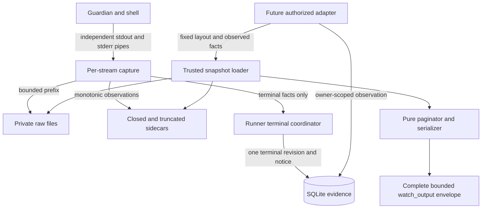
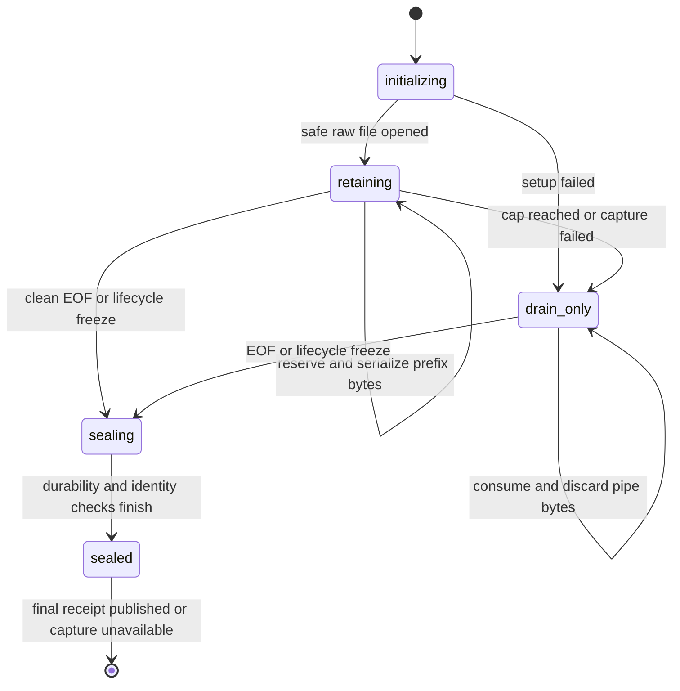
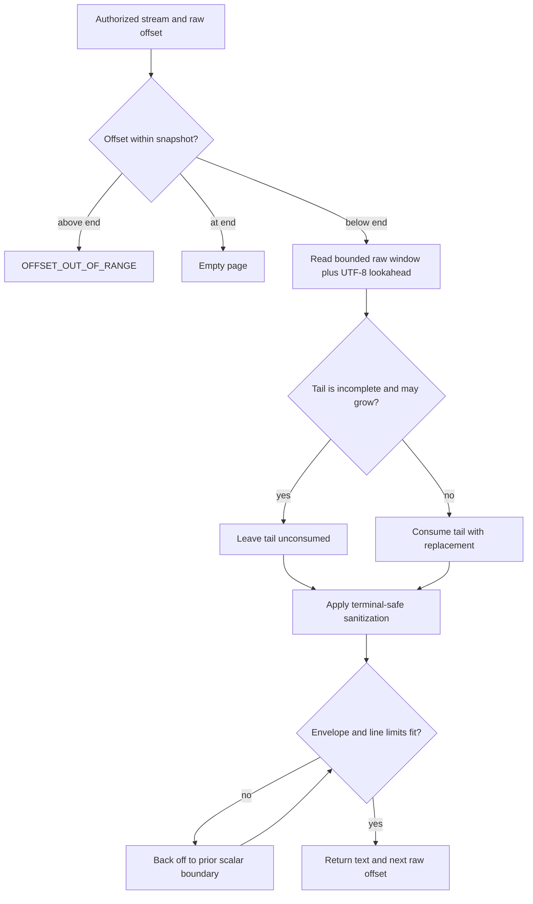

# U2-W4 Bounded Output Capture - Plan

Parent plan: [pi-watch v0.1 Background Commands](2026-09-09-1329-feat-v0-1-background-commands-plan.md), parent-plan U2 and KTD8.
Baseline: [U2-W3 launch skeleton](2026-09-11-u2-w3-launch-skeleton-addendum.md), [launch contract](../u2-launch.md), [storage contract](../u1-storage.md), and [store worker](../u1-worker.md).
This addendum supplements the parent plan without changing its Product Contract.

## Goal Capsule

- **Objective:** An owner can retrieve bounded stdout and stderr from a background command without output volume or a surviving writer preventing a finite, honest result.
- **Means:** Retain independent private raw-byte prefixes, end capture through a timed cutover, publish terminal capture facts once, and expose complete bounded raw-offset response envelopes (KTD1-KTD9).
- **Authority:** The parent plan wins on product behavior; this addendum owns W4 implementation choices; current source and tests define the W3 baseline.
- **Execution profile:** One test-first W4 slice on the W3 baseline, with no schema migration, Pi tool registration, or W5 recovery behavior.
- **Stop conditions:** Stop if safe capture requires an arbitrary path, unbounded memory or I/O waiting, a second command launch, contradictory evidence, or a schema change not reviewed under the fresh-schema policy.
- **Tail ownership:** Local verification and independent review are part of W4; commit, push, PR, merge, package publication, and later slices require separate authority.

---

## Product Contract

### Summary

W4 replaces W3's drain-and-discard output handling with private, bounded capture and a Pi-independent output reader.
Each stream retains at most its first 5,242,880 raw bytes, continues draining overflow, and becomes readable through independent raw-byte offsets.
Finalization remains finite when descendants keep pipes open, and every result distinguishes capture facts from shell outcome and cleanup certainty.

### Problem Frame

W3 can run and finalize a command, but it discards all output and may destroy its read endpoints as soon as guardian observation ends.
Waiting for pipe EOF would make a result depend on every surviving writer, while publishing capture progress through SQLite would create durable revisions and owner notices for implementation details.
W4 must preserve useful output without weakening the one-shot launch boundary, finite shutdown, evidence monotonicity, private-path rules, or future owner authorization.

### Key Decisions

- **Bounded files, cutover, and offsets are one W4 slice.** (session-settled: user-approved — chosen over continuing drain-only behavior or broadening capture beyond 5 MiB: the next lifecycle slice must earn useful bounded output without delaying W5.) Governs R1-R8.
- **The parent v0.1 plan is a public planning source.** (session-settled: user-directed — chosen over retaining it only in maintainer-local state: contributors need the KTD and scenario authority cited by this addendum.) Governs R9.

### Requirements

**Capture and lifecycle**

- R1. Retain the first 5,242,880 raw bytes separately for stdout and stderr while continuing to consume and discard every observed overflow byte; queued and in-flight retained data must remain bounded per stream. Advances parent R9 and R15.
- R2. Store capture only in deterministic private files reached through the same fixed-layout capability as the validated store; reject pre-existing unsafe type, permission, symlink, hardlink, identity, or containment conditions without accepting a fallback path. Active namespace mutation by another process with the same OS identity remains outside the inherited threat model. Advances parent R3, R15, and R16.
- R3. Start one monotonic 1,000 ms capture cutover when guardian exit or loss ends cleanup observation, or when the cleanup-observation budget expires; do not wait for EOF, child `close`, or descendant exit. Advances parent R5, R8, R9, and R14.
- R4. At cutover, freeze control and stream observations, close runner-owned read endpoints, finish only bounded queued writes, durably seal each trustworthy retained prefix and its fixed metadata, then attempt one terminal result publication. Advances parent R5, R8, and R15.
- R5. Keep capture availability, retention truncation, incompleteness, open-at-cutover, shell outcome, cleanup certainty, and result durability independent; output I/O failure cannot become complete capture or command failure. Advances parent R8-R10 and R15.

**Output reading**

- R6. Read stdout and stderr as independent immutable snapshots through zero-based raw-byte offsets from 0 through 5,242,880, with exact end-of-snapshot and out-of-range behavior and no reconstructed interleaving. Advances parent R1 and R15.
- R7. Decode with replacement and return terminal-safe text: preserve LF and horizontal tab, show CR as `\r`, and show other C0 controls, DEL, C1 controls, and ESC as lowercase `\xhh` escapes. Advances parent R1 and R15.
- R8. Bound every complete version-1 success or error envelope to 51,200 serialized UTF-8 bytes. Each success envelope additionally limits output text to 2,000 logical lines and returns a resumable next raw-byte offset without splitting a complete valid scalar at a server-selected boundary. Advances parent R1 and R15.

**Evidence, privacy, and scope**

- R9. File growth, EOF, sidecar creation, and pagination must not create result revisions or notices; a normal launched job has one launch revision and one terminal revision, while pre-launch suppression remains one atomic terminal revision, each paired with one notice. Advances parent R6-R8.
- R10. Sanitized captured output may appear only in `data.text` of a successful owner-authorized `watch_output` envelope. Output content is otherwise prohibited from diagnostics, control messages, sidecars, response metadata, error envelopes, assertion diffs, test reporter output, captured subprocess logs, error causes/stacks, CI artifacts, and committed artifacts; command text, environment values, private paths, owner metadata, and raw filesystem errors are prohibited from every one of those surfaces. Advances parent R3, R13, R15, and R16.
- R11. Retained output remains private and indefinite in v0.1; the per-stream cap is not a cumulative quota, and W4 adds no deletion, expiry, or reclamation for completed or partial artifacts. Advances parent R16.
- R12. W4 adds no cancellation forwarding, heartbeat, stale-witness reconciliation, Pi tool registration, delivery, scheduler, daemon, or generic orchestration behavior.

### Acceptance Examples

- AE1. **Independent bounded prefixes.** Given distinct stdout and stderr streams larger than 5,242,880 bytes, when the command completes, each retained file is byte-for-byte equal to its own first 5,242,880 bytes, each stream reports truncation, and a post-output side effect proves overflow did not block the command. Covers R1 and R5.
- AE2. **Exact cap is not overflow.** Given exactly 5,242,880 bytes followed by clean EOF, when capture closes, the file is exactly the cap and `truncated` is false. Covers R1 and R5.
- AE3. **Surviving writer cannot hold finalization.** Given a known root exit, a killed guardian, and a self-expiring descendant that still owns both writers, when the cutover interval expires, the runner publishes the retained prefixes with `openAtCutover` and `incomplete` true before the descendant closes them. Covers R3-R5.
- AE4. **Growing UTF-8 tail resumes.** Given a snapshot ending inside a valid scalar and capture that may still grow, when a page is requested, the incomplete tail remains unconsumed; after the remaining bytes arrive, the next request consumes the scalar once. Covers R6-R8.
- AE5. **Closed UTF-8 tail cannot strand.** Given the same incomplete bytes after growth becomes impossible, when a page is requested, replacement text is returned and the raw offset advances to the retained end. Covers R6-R8.
- AE6. **Unsafe pre-existing output path does not escape.** Given a symlink, hardlink, wrong-type, wrong-owner, or wrong-mode component at a fixed capture path before setup, when setup runs, the outside target is unchanged, the affected capture is unavailable and incomplete, and the independently authorized command still runs once with output drained. Covers R2, R5, and R10.
- AE7. **Known unavailable capture remains an honest snapshot.** Given authoritative SQLite evidence that a stream is unavailable, an offset-zero read returns a successful empty snapshot with the durable capture facts, while a positive offset is out of range. If availability is not durably false and an expected artifact cannot be opened or identity-bound, the read returns `CAPTURE_UNAVAILABLE` instead. Covers R5, R6, and R8.

### Scope Boundaries

**In W4**

- Private raw-byte capture, overflow draining, closure observations, timed cutover, terminal stream evidence, pure snapshot loading, bounded pagination, sanitization, tests, build coverage, and internal documentation.
- The complete future version-1 `watch_output` success/error envelope, so parent-plan U3 adds authorization and tool wiring without changing W4 serialization or pagination semantics.

**Deferred to Follow-Up Work**

- W5 live cancellation forwarding, runner heartbeats, stale-witness reconciliation, and late-evidence refinement.
- Parent-plan U3 owner lookup, missing-job masking, Pi tool validation/registration, delivery, and notice routing.
- Parent-plan U5/U6 real Pi quit/reload proof, full supported-OS evidence, isolated packed installation, and public installation guidance.

**Outside this slice**

- Arbitrary output paths, combined stdout/stderr ordering, raw-output download, per-job deletion, automatic expiry, a daemon, a scheduler, a second storage backend, or any replacement runner.
- Defense against an actively malicious process running as the same OS user and mutating ancestor directory names between pathname operations; W4 must detect unsafe final artifacts and refuse them as evidence, but cannot promise portable descriptor-relative traversal that Node does not expose.

### Product Contract Preservation

Parent Product Contract unchanged.
W4 narrows implementation of parent KTD8 and parent-plan U2 scenarios 7, 9, 11, 12, 15, and 16 without weakening parent R1, R5, R7-R10, or R14-R16.

---

## Planning Contract

### Key Technical Decisions

- KTD1. **Keep schema 2 and add monotonic private sidecars.** Existing SQLite fields already own terminal availability, truncation, incompleteness, and open-at-cutover.
  Raw length comes from `fstat` on an opened snapshot; fixed sidecars expose bounded capture-growth observations before terminal publication.
  If implementation proves this cannot satisfy R5-R8, stop for review under the [fresh-schema policy](2026-09-10-u2-launch-control-addendum.md) rather than add a migration silently.
- KTD2. **Share one fixed-layout capability from store validation.** `src/private-path.ts` is a leaf that imports only Node filesystem/path APIs and redacted error definitions; store, capture, and reader modules may import it, and it imports none of them.
  Store validation produces an in-memory fixed-layout capability from the trusted root and canonical `jobs.sqlite`; it alone derives `jobs/<lowercase-job-uuid>/` and fixed stream names.
  Callers cannot supply a descendant or filename, aliases resolve through the same canonicalization, and active same-UID namespace mutation remains outside the threat model.
  Every opened final artifact must still be a regular file with expected owner, mode, link count, device/inode identity, and unchanged path binding before its evidence is trusted.
- KTD3. **Publish bounded sidecars through one explicit protocol.** `<stream>.raw` holds the retained prefix; zero-byte `<stream>.truncated` is exclusively created after the first overflow byte; `<stream>.closed.json` is published only when source observation seals at EOF or lifecycle cutover.
  The closure reason is `capture_error` when any earlier capture loss occurred, otherwise `eof` when observed, otherwise `cutover`; reaching the retention cap is an independent `canGrow: false` rule, not a closure reason.
  Closure JSON is canonical, no more than 512 UTF-8 bytes, and has exactly the version, stream, retained count, truncation, incompleteness, open-at-cutover, reason, and raw device/inode fields; bounded parsing rejects unknown/duplicate keys, trailing bytes, invalid ranges, identity mismatch, and non-canonical encoding.
  The truncation marker is exactly zero bytes, regular, private, singly linked, and identity-checked.
- KTD4. **One constant-cardinality capture state machine per stream.** Each stream has at most one active write and one coalesced bounded buffer; it never creates one promise, task, or callback per input chunk.
  Bytes are reserved before admission, boundary chunks are sliced, short writes preserve a contiguous prefix, and queued plus in-flight retained data never exceeds the remaining cap.
  Cap or capture failure ends retained growth but continues drain-only source consumption; stdout and stderr fail independently.
- KTD5. **Use two explicit terminal owners.** `decideLaunch` remains the sole owner of atomic pre-launch suppression and records both streams as unavailable, non-truncated, complete, and not open-at-cutover without creating a workspace.
  After `authorized_now`, the runner prepares capture before grant; post-authorization shell-spawn failure closes and best-effort removes its exact empty staging artifacts, then publishes unavailable complete streams without treating leftovers as output evidence.
  Every launched path is owned by the runner's terminal coordinator.
- KTD6. **The launched coordinator is a fenced state machine.** It moves through `observing`, `cutting_over`, `freezing`, `publishing`, and `closed`.
  The first eligible guardian-loss or budget-expiry trigger alone sets the monotonic cutover deadline; later triggers cannot restart or shorten it.
  Allowlisted guardian/control evidence may refine memory until `freezing`; freeze first disables control mutation and stream intake, then seals both captures, snapshots facts once, queues one terminal publication behind any launch publication, and runs shared shutdown regardless of publication outcome.
- KTD7. **Omit provisional stream facts and prohibit progress publication.** W3's launched unavailable/incomplete facts cannot refine to W4's terminal available/complete facts under `mergeEvidence`.
  W4's launched revision records launch and cleanup facts only; data, EOF, cap, sidecar, and page callbacks never call `publishResult`.
  Tests race simultaneous disconnect/exit/budget/EOF and callbacks on both sides of the freeze boundary.
- KTD8. **Separate authorized SQLite observation, trusted loading, and pure pagination.** The future authorized adapter takes one owner-scoped SQLite observation first and passes only its finalized/capture facts plus the fixed-layout capability to the loader; the loader never queries SQLite.
  The loader opens and identity-binds the raw file, rejects raw size above 5,242,880, snapshots length, then reads sidecars with fixed ceilings.
  When the preceding SQLite observation is nonfinal and still permits growth, a closure receipt above the captured length belongs to a later snapshot and is ignored conservatively. If that observation is finalized or otherwise proves growth impossible, an above-length receipt is corrupt; any below-length receipt is corrupt.
  Positional raw reads are bounded to one response window plus at most three UTF-8 lookahead bytes, and the paginator performs no SQLite, owner, process, path, or Pi work.
- KTD9. **W4 owns complete version-1 success and error envelopes.** The serializer selects the largest scalar-safe raw prefix satisfying both limits after replacement, sanitization, metadata, and JSON escaping.
  Authoritative SQLite evidence that a stream is unavailable returns a successful offset-zero empty snapshot with retained/next offsets `0`, `hasMore: false`, `canGrow: false`, and the durable capture facts; a positive offset is out of range.
  Fixed redacted errors are `INVALID_OFFSET`, `OFFSET_OUT_OF_RANGE`, `CAPTURE_UNAVAILABLE`, `CAPTURE_CORRUPT`, and `OUTPUT_READ_FAILED`. `CAPTURE_UNAVAILABLE` means availability is not durably false and an expected raw artifact cannot be opened or identity-bound; success and error objects both contain `schemaVersion` and `ok` and fit the same 51,200-byte extension limit.
  Parent-plan U3 authorizes, masks missing/foreign jobs, registers the tool, and returns these bytes without another data/result wrapper; host framing remains outside the bound.
- KTD10. **Durability decides availability without changing launch authority.** Setup/write failure switches only that stream to bounded drain-only; a contiguous partial prefix is available and incomplete only if later sync, close, identity, sidecar, and directory-durability checks all succeed.
  Seal ordering is raw write completion, raw sync, raw close, sidecar exclusive write/sync/close, atomic temporary-receipt rename, workspace-directory sync, final identity/coherence check, then terminal `publishResult`.
  Any failed durability/coherence step makes terminal capture unavailable and incomplete but does not turn a launched command into `spawn_failed` or authorize a retry.
- KTD11. **One PR preserves the observable contract.** Capture artifacts, suppression facts, cutover, terminal evidence, complete response envelopes, and lifecycle tests land together because no subset is independently verifiable against parent KTD8.
  Internal commits may remain test-first and component-focused.

### High-Level Technical Design

#### Components and authority



SQLite owns job/result truth.
Raw files own retained bytes, and sidecars own capture-growth observations only; neither grants owner access, launch authority, command success, or cleanup certainty.

Module dependencies point inward to the leaf `src/private-path.ts`: `src/job-store.ts`, `src/store-client.ts`, `src/output-capture.ts`, and `src/output.ts` may use its fixed-layout capability, while it imports none of them.
`src/output-capture.ts` owns writes and sealing; `src/output.ts` owns bounded reads and complete envelopes; `src/runner.ts` coordinates them without either output module importing process control or the store.

#### Lifecycle and cutover

```mermaid
sequenceDiagram
  participant S as Shell or descendant
  participant C as Capture
  participant G as Guardian channel
  participant T as Terminal coordinator
  participant D as SQLite
  S->>C: stdout and stderr bytes
  C->>C: reserve bounded prefix; drain overflow
  G-->>T: first guardian exit/loss or budget expiry
  Note over T,C: observing -> cutting_over; set one 1,000 ms deadline
  S->>C: bytes may continue during cutover
  T->>T: cutting_over -> freezing; reject later mutations
  T->>C: stop intake and close read endpoints
  C->>C: finish bounded writes; sync and close raw files
  C->>C: sync markers; atomically publish closure receipts; sync directory
  T->>D: publishing; enqueue terminal facts behind launch publication
  T->>T: closed; shut down regardless of publication outcome
```

Cleanup-budget expiry enters at the same cutover start.
Filesystem or kernel stalls can exceed the healthy-runtime timing target; they cannot authorize an unbounded retry, queue, or wait for EOF.

#### Per-stream state



Reaching the cap ends retained growth but is not truncation by itself.
Only an observed overflow byte creates the truncation sidecar, and the immutable closure receipt waits until EOF or lifecycle freeze so `openAtCutover` is knowable.

#### Snapshot and page selection



The adapter reads one SQLite observation before filesystem loading.
The loader snapshots raw identity and length before sidecars. A closure count above that length is ignored as a later snapshot only when SQLite is nonfinal and still permits growth; with finalized or no-growth SQLite evidence, an above-length count is corrupt, and a below-length count is always corrupt.
A missing coherent closure receipt below the cap on a non-finalized job means growth is possible or unknown, never that a runner is alive; a coherent receipt, a prefix at the cap, or terminal SQLite evidence makes `canGrow` false.

### Capture Fact Matrix

| Observation | Available | Truncated | Incomplete | Open at cutover | Growth can continue |
| --- | --- | --- | --- | --- | --- |
| Safe empty file, active below cap | true | false unless marker exists | false | false | true unless closure exists |
| Exact cap, no overflow observed | true | false | false | false | false |
| Overflow observed | true | true | false unless another loss occurred | false until cutover | false |
| Clean EOF and successful seal | true | as observed | false | false | false |
| Write failure, followed by successful durability/identity proof for a contiguous prefix | true | as observed | true | source-dependent at cutover | false |
| Sync, close, sidecar, directory-sync, or final identity failure | false | as durably observed | true | source-dependent at cutover | false |
| Unsafe setup or no trustworthy artifact | false | false | true | source-dependent at cutover | false for retained growth |
| Source still open when cutover expires | artifact-dependent | as observed | true | true | false |
| Atomic pre-launch suppression | false | false | false | false | false |
| Post-authorization shell-spawn failure | false | false | false | false | false |

Truncation means retention overflow, not general incompleteness.
Availability means a trustworthy readable artifact exists, not that it contains every emitted byte.

### Crash-State Interpretation

| Observed state | Reader interpretation | Result authority |
| --- | --- | --- |
| Raw file only | Active or crashed capture; bounded snapshot may grow unless already at cap | No final result inferred |
| Temporary closure receipt only | Ignore the temporary file; it is not published closure | No final result inferred |
| Truncation marker without closure | Overflow was durably observed; capture may remain active | No shell or finalization inference |
| Coherent final closure receipt | Prefix is sealed for the matching raw identity and snapshot | Still no command/result inference |
| Sidecars durable, SQLite not finalized | Retained artifacts exist but the job result is nonfinal or unknown | W5 may later refine; W4 does not |
| SQLite finalized with stream unavailable and no raw artifact | Return the successful empty snapshot and durable capture facts at offset zero | No artifact is invented or recreated |
| SQLite finalized with stream available but required sidecar missing/malformed | Terminal SQLite facts remain authoritative; output read returns a fixed capture error rather than invent bytes | No sidecar repair in W4 |
| Artifact deleted or replaced after finalization | Output is unavailable/corrupt at read time; terminal result remains unchanged | No result rollback or recreation |

### Future Output Envelope

| Field | Meaning |
| --- | --- |
| `schemaVersion` | Version `1` envelope contract |
| `ok` | `true` for this success shape |
| `data.stream` | Exactly `stdout` or `stderr` |
| `data.offsetBytes` | Validated input raw-byte offset |
| `data.nextOffsetBytes` | First unconsumed raw-byte offset |
| `data.retainedBytes` | `fstat` size captured for this call's snapshot |
| `data.hasMore` | Whether `nextOffsetBytes` is below this snapshot's retained end |
| `data.canGrow` | Whether later calls may observe a longer retained prefix |
| `data.available` | Whether the stream has a trustworthy readable artifact |
| `data.truncated` | Whether a retention-overflow byte was observed |
| `data.incomplete` | Whether capture lost or cut off potentially retainable bytes |
| `data.openAtCutover` | Whether EOF was absent when lifecycle cutover expired |
| `data.text` | Sanitized text selected within both response limits |

When authoritative SQLite evidence says the stream is unavailable, offset zero returns this success shape with empty text, zero retained/next offsets, `hasMore: false`, `canGrow: false`, and the durable capture flags; any positive offset returns `OFFSET_OUT_OF_RANGE`.
The same constructor returns complete errors as `{ schemaVersion: 1, ok: false, error: { code, message } }` with fixed messages and no native detail.
W4 owns `INVALID_OFFSET`, `OFFSET_OUT_OF_RANGE`, `CAPTURE_UNAVAILABLE`, `CAPTURE_CORRUPT`, and `OUTPUT_READ_FAILED`. `CAPTURE_UNAVAILABLE` is reserved for a stream not durably known unavailable whose expected raw artifact cannot be opened or identity-bound; parent-plan U3 owns authorization and missing/foreign-job policy, then passes the selected W4 envelope through without another wrapper.
Every success and error envelope is bounded by the same 51,200-byte extension limit; host framing is outside it.

### Sequencing

1. Freeze suppression ownership, fixed-layout paths, capture state, sidecars, envelopes, and crash-state interpretation in failing focused tests.
2. Implement shared canonical layout handling and independent per-stream capture without runner integration.
3. Implement snapshot loading and complete success/error envelope construction against fixed artifacts.
4. Change `decideLaunch` suppression to commit concrete non-execution stream facts and no workspace.
5. Add failing real-process cutover, overflow, event-race, failure, evidence, notice-count, and teardown scenarios.
6. Integrate capture after `authorized_now` and before grant through the launched terminal coordinator; remove W3 provisional stream facts.
7. Update build expectations and internal documentation, then run bounded local verification and independent review.

### Risks and Mitigations

| Risk | Mitigation |
| --- | --- |
| A surviving writer keeps the pipe open forever | One monotonic cutover closes runner-owned read endpoints without awaiting EOF; the test holds descriptors open past publication. |
| Asynchronous writes grow memory or reorder the prefix | Allow one active write plus one coalesced bounded buffer per stream; test bytes, object/task cardinality, and post-cutover work with one-byte chunks. |
| Sidecar and SQLite facts disagree after a crash | Apply the crash-state table, strict bounded parsing, snapshot coherence rules, and SQLite result authority; W4 never repairs partial state. |
| Reaching the cap is mistaken for observed overflow | Separate closed and truncated artifacts; test exact-cap EOF and cap-plus-one independently. |
| Path replacement produces unsafe evidence | Limit the claim to the inherited same-UID threat model; use fixed names, exclusive/no-follow opens, owner/mode/link/identity checks, and reject replacement rather than trust it. |
| Corrupt or oversized artifacts cause unbounded parsing | Cap closure JSON at 512 bytes plus one probe byte, require zero-byte markers and raw size at most 5,242,880, and use bounded positional reads with fixed errors. |
| Sanitization expands beyond the response bound | Measure complete success and error envelopes and back off only at whole raw-token/scalar boundaries. |
| Final result commits before output is durable | Complete raw/sidecar sync, close, rename, directory sync, and identity/coherence checks before `publishResult`; failed durability makes capture unavailable/incomplete. |
| Final SQLite publication fails after files close | Exit finitely without reopening capture or retrying execution; W5 owns later uncertainty refinement. |
| Tests leak the secrets they are meant to protect | Compare lengths, hashes, counts, and first differing offsets; a child-test failure probe verifies reporter output, captured subprocess logs, stacks, and CI artifacts remain sentinel-free. |
| Output contains secrets and accumulates indefinitely | Private modes, redacted diagnostics, tarball exclusion, and documentation that two streams, sidecars, SQLite/WAL, failures, and orphaned partial artifacts accumulate across an unbounded job count with no quota or reclamation. |

### System-Wide Impact

- **Runner and store:** W4 changes when stream facts first become durable and adds concrete non-execution facts to the existing suppression transaction; it does not change launch authority, command replay, or notice atomicity.
- **Future Pi adapter:** Parent-plan U3 receives a complete bounded output envelope and a fixed-layout capability, so agent access cannot introduce arbitrary paths, a second serializer, or model-driven filesystem polling.
- **Local storage:** Every job may retain two 5 MiB prefixes plus sidecars and database/WAL state indefinitely; failed and runner-loss paths may leave non-authoritative remnants, with no cumulative quota or reclamation.
- **Security boundary:** Private modes and owner-scoped future tools protect ordinary local use, not a hostile process sharing the same OS identity; output and commands may contain secrets, and tests/logging must remain redacted even when assertions fail.
- **Operations and portability:** The actor intentionally waits are bounded, but kernel/filesystem stalls are not hard real-time bounded; W4 earns no new OS, Pi reload, or package-installation claim.

### Sources and Research

- [Parent v0.1 plan](2026-09-09-1329-feat-v0-1-background-commands-plan.md): R1, R5, R7-R10, R14-R16, KTD5-KTD8, Public Tool Contract, and parent-plan U2 scenarios 7, 9, 11, 12, 15, and 16.
- [W3 addendum](2026-09-11-u2-w3-launch-skeleton-addendum.md): runner/guardian topology, seven-second observation budget, drain-only baseline, evidence boundary, and real-process test conventions.
- `src/runner.ts`: serialized publication, current provisional stream facts, no-op drains, immediate guardian-loss finalization, and resource shutdown.
- `src/store-evidence.ts`: schema-2 stream facts and monotonic merge rules.
- `src/job-store.ts`: private descendant validation and atomic result-revision/notice publication.
- `tests/runner.test.ts`: explicit-timeout lifecycle harness and the W3 whole-group guardian-loss test that W4 must not reuse as proof of a surviving writer.
- No `docs/solutions/` corpus or Compound Pack applied to this plan; external research was not load-bearing because W4 uses settled local contracts and built-in runtime primitives.

---

## Invariant-to-Test Map

| ID | Invariant and enforcement location | Named proof |
| --- | --- | --- |
| I1 | `src/output-capture.ts` independently retains only each stream's first 5,242,880 bytes and drains overflow. | `capture retains exact independent prefixes and drains overflow` |
| I2 | Truncation becomes true only after an overflow byte, not merely when the cap is filled. | `exact cap followed by EOF is not truncation` and `cap plus one creates truncation` |
| I3 | Capture permits one active write and one coalesced buffer per stream; byte and pending-operation counts are bounded. | `one-byte chunks keep queue bytes and task cardinality bounded` |
| I4 | Short writes either preserve a contiguous prefix or make the artifact unavailable. | `short writes never expose a retained hole` |
| I5 | `src/private-path.ts` accepts only fixed layout components and validates type, owner, mode, link count, device/inode, and replacement under the inherited threat model. | `fixed capture paths reject unsafe pre-existing artifacts` and `replaced artifacts are never trusted as evidence` |
| I6 | Atomic suppression is owned by `decideLaunch`, records concrete non-execution stream facts, and creates no workspace. | `pre-launch suppression finalizes streams without capture artifacts` |
| I7 | Post-authorization shell-spawn failure invalidates exact staging artifacts and publishes unavailable complete streams. | `shell spawn failure never exposes staging files as output` |
| I8 | EOF seals capture but never publishes a result or changes cleanup certainty. | `clean EOF closes capture without finalizing lifecycle` |
| I9 | Guardian exit/loss starts one full cutover while a self-expiring survivor still writes. | `guardian loss cuts over after one second with live writers` |
| I10 | Cleanup-observation budget expiry starts the same cutover without guardian evidence. | `cleanup budget starts cutover without guardian evidence` |
| I11 | Simultaneous triggers set one deadline; evidence before freeze is accepted and callbacks after freeze cannot mutate or republish. | `terminal coordinator fences trigger and late-callback races` |
| I12 | Setup/write/sync/close/sidecar/directory failures affect only the relevant stream, continue draining, and reach finite shutdown. | `ordered capture failures keep the unaffected stream usable and shutdown finite` |
| I13 | The launched revision omits stream facts and capture progress produces no revisions/notices. | `capture emits only launch and terminal revisions` |
| I14 | Raw files, markers, closure receipts, and directory entries pass the full durability/identity sequence before terminal result publication. | `terminal publication follows durable coherent capture artifacts` |
| I15 | Snapshot loading binds the opened file, freezes its length, bounds every raw/sidecar read, and handles append/seal races conservatively. | `snapshot protocol is bounded and race coherent` |
| I16 | Raw artifacts above 5,242,880 bytes, closure JSON above 512 bytes, nonempty markers, and noncanonical receipts fail with fixed redacted errors. | `oversized or malformed private artifacts are rejected within read ceilings` |
| I17 | Stdout/stderr offsets are independent raw-byte cursors with exact end and out-of-range behavior. | `independent raw offsets resume without loss or duplication` |
| I18 | Mid-sequence caller offsets and malformed UTF-8 decode with replacement while server page ends preserve complete valid scalars. | `mid-sequence and malformed UTF-8 preserve raw offset accounting` |
| I19 | A growing incomplete tail remains unconsumed; a closed tail is consumed once as replacement. | `growing and closed incomplete UTF-8 tails diverge correctly` |
| I20 | Sanitization preserves LF/tab and visibly escapes CR, C0, DEL, C1, and ESC. | `output pages preserve LF and tab but contain no disallowed terminal controls` |
| I21 | The largest page fits 2,000 logical lines and every complete success/error envelope fits 51,200 serialized bytes. | `success and error envelope bounds are exact and resumable` |
| I22 | Shell result, cleanup certainty, capture facts, and durable publication remain independent under failure and every crash state follows the plan table. | `capture evidence never upgrades cleanup or rewrites shell outcome` and `artifact crash states never invent a final result` |
| I23 | Output and private metadata never escape through production or test failure surfaces. | `capture failures redact every synthetic secret domain` and `failing assertion reporters remain sentinel-free` |
| I24 | A preinstalled per-test registry records PID/PGID ownership and its `after` hook reaps only those identities even after timeout or assertion failure. | `owned process registry reaps actors after injected test failure` |
| I25 | Durable unavailable evidence produces one successful empty offset-zero snapshot; a missing expected artifact follows the separate fixed error path. | `known unavailable and unexpectedly absent captures have distinct envelopes` |

Tests must use non-idempotent byte counts, append counts, and one receipt per event.
File existence alone is never a capture oracle, and a whole-process-group kill is never the trigger for I6.

---

## Shutdown Matrix Delta

| Trigger/state | W3 behavior | W4 required behavior | Terminal evidence ceiling |
| --- | --- | --- | --- |
| Pre-launch suppression | `decideLaunch` finalizes atomically before returning | Keep `decideLaunch` as sole owner; store concrete unavailable, non-truncated, complete stream facts and create no workspace | One terminal revision/notice; existing suppression and cleanup facts |
| Post-authorization shell-spawn failure | Runner may already own output pipes | Close and best-effort remove only exact empty staging artifacts; publish unavailable complete streams with no cutover delay | `spawn_failed`, cleanup not required, no output artifact authority |
| Normal root exit and guardian cleanup | Guardian exit may finalize immediately | Guardian exit starts one full cutover, then seals files before publication | Known shell result with cleanup unconfirmed and capture facts as observed |
| Guardian exit/loss with surviving writer | Close streams during immediate finalization | Continue intake for 1,000 ms, then close read endpoints without EOF | `openAtCutover` and `incomplete` true; no descendant-stop claim |
| Guardian remains after cleanup trigger | Seven-second budget directly finalizes | Budget expiry starts the separate 1,000 ms cutover | Missing guardian facts stay unknown; capture still finalizes honestly |
| Concurrent exit/disconnect/error/budget/EOF | Multiple callbacks can enter W3 finalize/close paths | First eligible trigger owns one deadline, freeze rejects later mutation, and terminal publication queues once behind launch publication | Facts accepted before freeze only, with no duplicate revision or shutdown |
| Both streams reach EOF early | Drained data remains unavailable | Seal each raw prefix and publish its coherent `eof` closure receipt at EOF; defer terminal SQLite publication until lifecycle freeze | Capture may be complete; cleanup remains unconfirmed |
| One stream reaches retention cap | Bytes remain discarded | Seal retained growth, keep draining overflow, leave other stream independent | `truncated` only after overflow is observed |
| One stream has I/O failure | Generic unavailable/incomplete stream state | Preserve any safe contiguous prefix, switch that stream to drain-only, continue lifecycle | Affected stream incomplete and possibly available; other stream unchanged |
| Final SQLite publication fails | Close after one bounded publication attempt | Keep sealed files, close finitely, do not reopen/relaunch or claim durable finalization | Files are not a finalized result; W5 owns later refinement |
| Runner is killed | Guardian cleans on channel loss | No W4 replacement or file finalizer; partial artifacts remain non-authoritative | Durable evidence remains whatever committed before death |

The parent plan's roughly six-second healthy normal-path expectation already includes guardian grace plus W4 cutover.
Closing read endpoints may expose surviving writers to EPIPE/SIGPIPE and is not cleanup evidence.

---

## Evidence Authority Delta

| Source | Authoritative for | Never proves |
| --- | --- | --- |
| SQLite job/result revision | Owner/job identity, launch, shell outcome, cleanup observations, terminal capture flags, finalization, and result-to-notice atomicity | All descendants stopped; every emitted byte was captured; a file path is safe now |
| `<stream>.raw` opened and `fstat`-bound | Exact retained bytes and byte count for that call's snapshot | Shell launch/success, terminal result durability, owner access, cleanup, or future growth |
| `<stream>.closed.json`, within 512 bytes and coherent with raw identity | A sealed prefix, its retained count, and why source observation ended | Command completion, descendant death, or result publication |
| Zero-byte `<stream>.truncated` | At least one overflow byte was durably observed after the retained cap | General capture completeness, shell outcome, or cleanup |
| Runner memory | Pending bounded writes and not-yet-published guardian/capture observations | Durable evidence after runner loss |
| Pi transcript or future tool response | Delivery/read presentation after parent-plan U3 authorization | Execution authority or independent process truth |

Required ordering:

1. `decideLaunch` owns atomic suppression and stream non-execution facts; only `authorized_now` permits workspace setup, followed by the one-time grant regardless of setup success.
2. The authorized adapter observes SQLite first; the loader then snapshots raw identity/length before reading sidecars. It ignores an above-length future-snapshot receipt only for nonfinal observations that still permit growth; finalized/no-growth mismatch is corrupt.
3. Lifecycle freeze disables control mutation and stream intake before terminal facts are copied once.
4. Seal ordering is raw write, raw sync, raw close, sidecar write/sync/close, temporary-receipt rename, workspace-directory sync, and final identity/coherence checks.
5. Terminal `publishResult` queues after any launch publication only when the seal sequence ends; shared shutdown runs for success, unknown acknowledgement, and failure.
6. File writes, sidecars, snapshots, and pages never create SQLite revisions or notices.
7. A live read is a conservative snapshot across filesystem and SQLite state; it never claims cross-resource transactional atomicity.

Forbidden inferences:

- File existence, size, EOF, closure, or truncation does not prove shell success or completion.
- EOF, cutover, or EPIPE/SIGPIPE does not prove process-group cleanup.
- A finalized result does not prove descendant absence.
- A capture artifact without a terminal SQLite revision is not a finalized job result.
- A sidecar never overrides contradictory terminal SQLite evidence; contradiction is a fixed capture error, not a merge rule.
- A temporary receipt, oversized artifact, duplicate-key JSON, conservatively ignored future-snapshot receipt, finalized-snapshot mismatch, or replaced identity never becomes closure evidence.
- Active malicious namespace mutation by the same OS user is outside the security boundary; detecting a changed final identity prevents trust but does not claim no pathname was ever redirected.

---

## Implementation Units

### U1. Private bounded capture primitives

- **Goal:** Create safe per-job stream workspaces and independent bounded capture state machines.
- **Requirements:** R1-R5, R9-R10; KTD1-KTD4 and KTD10; AE1, AE2, and AE6.
- **Dependencies:** W3 merged baseline.
- **Files:** `src/private-path.ts`, `src/output-capture.ts`, `src/job-store.ts`, `src/store-client.ts`, `src/test-seams.ts`, `tests/output.test.ts`, `tests/job-store-startup.test.ts`.
- **Approach:**
  1. Extract a leaf fixed-layout capability used by store opening, capture, and reading without changing existing database path behavior.
  2. Implement fixed workspace/artifact derivation, 0700/0600 exclusive creation, descriptor identity/coherence checks, and the explicit same-UID threat boundary.
  3. Implement one active write plus one coalesced buffer per stream, overflow drain-only behavior, bounded canonical receipts, and ordered durability/fault mapping.
  4. Keep all fault injection and high-water telemetry centralized, environment-gated, and unreachable from production arguments.
- **Execution note:** Start with failing byte-exact, path-race, queue-bound, short-write, and failure-matrix tests before integrating the runner.
- **Patterns to follow:** `src/job-store.ts` private database preparation and redacted errors; `src/store-evidence.ts` monotonic facts; `src/test-seams.ts` test-only boundaries.
- **Test scenarios:**
  1. Covers AE1. Feed one-byte chunks with distinct patterns above both caps; assert exact prefixes, overflow observations, one active write plus one coalesced buffer, bounded bytes/tasks/callbacks, and no post-seal work.
  2. Covers AE2. Feed exactly the cap and EOF, then cap plus one; only the latter creates an exactly zero-byte truncation marker.
  3. Force short writes at multiple positions; the readable file remains one contiguous known prefix or becomes unavailable, never a hole presented as valid output.
  4. Fail each raw write/sync/close, marker write/sync/close, receipt write/sync/close/rename, directory sync, and final identity check in order; the other stream remains independent and shutdown stays finite.
  5. Preseed symlink, hardlink, wrong type/owner/mode/link count, root alias, and concurrent `EEXIST` cases at each fixed component; assert stable failure and unchanged outside-target bytes for pre-existing hazards.
  6. Replace a parent or artifact at test seams after open; assert the changed identity is never trusted while preserving the stated same-UID threat boundary.
  7. Validate raw-only, temporary receipt, marker-only, final receipt, sidecar-without-SQLite, SQLite-without-sidecar, and post-final replacement/deletion crash states against the plan table.
  8. Place secrets in output, cwd, synthetic native errors, and paths; use hash/count/first-difference comparators so production diagnostics and failed assertion output remain sentinel-free.
- **Verification:** All capture/path tests prove exact bytes, strict modes, monotonic artifacts, bounded memory/work, and redacted finite failure.

### U2. Bounded output snapshots and pagination

- **Goal:** Produce the complete future `watch_output` success/error envelope from a trusted stream snapshot without Pi or owner logic.
- **Requirements:** R5-R8, R10; KTD1-KTD3 and KTD8-KTD9; AE4, AE5, and AE7.
- **Dependencies:** U1.
- **Files:** `src/output.ts`, `src/private-path.ts`, `src/output-capture.ts`, `tests/output.test.ts`.
- **Approach:**
  1. Consume one caller-supplied authorized SQLite observation, then identity-bind the fixed raw artifact and snapshot its length before reading sidecars.
  2. Accept only artifacts coherent with that snapshot under KTD8; bound raw and sidecar reads before allocation or parsing.
  3. Decode and sanitize while keeping raw-byte consumption separate from displayed and serialized byte counts.
  4. Return complete version-1 success/error envelopes and select the largest scalar-safe prefix whose full serialization fits both limits.
- **Execution note:** Implement the parser and page selector test-first from boundary tables, not by tuning against one fixture.
- **Patterns to follow:** Parent plan Public Tool Contract for raw offsets and display semantics; fixed-code/redaction style in `src/job-store.ts`.
- **Test scenarios:**
  1. Read empty, at-end, above-end, minimum, maximum, fractional, negative, and non-number offsets; assert the exact success or bounded error category.
  2. Traverse different stdout/stderr buffers with independent cursors and prove complete raw consumption without loss, duplication, or interleaving.
  3. Put valid one- through four-byte scalars on candidate page boundaries; server-selected ends never split a complete scalar.
  4. Start at every continuation byte and cover malformed starts, malformed interior bytes, and incomplete tails; assert replacement text and raw next offsets.
  5. Covers AE4/AE5. Present the same incomplete tail as growing and closed; only the growing page may leave its offset unchanged.
  6. Cover NUL, tab, LF, CR, ESC/ANSI, DEL, C1 boundaries, printable neighbors, quotes, and backslashes; serialized output preserves LF and tab but contains no disallowed terminal control byte.
  7. Construct exact 2,000/2,001-line and 51,200/51,201-serialized-byte boundaries, including sanitization and JSON escaping; the next page resumes exactly.
  8. Interleave append and seal between SQLite observation, raw open, `fstat`, marker read, and receipt read; nonfinal future-snapshot receipts stay conservative, finalized/no-growth mismatches are corrupt, and no race causes skipped bytes or false closure.
  9. Reject a raw file above 5,242,880 bytes, closure JSON above 512 bytes, duplicate/unknown keys, invalid ranges, noncanonical/trailing bytes, nonempty truncation markers, and raw/receipt identity or count mismatch with fixed redacted envelopes.
  10. Use a 5 MiB file and instrumented reads; assert only each artifact ceiling plus the response-sized raw window and no more than three lookahead bytes are requested.
  11. Serialize every success and W4-owned error at its boundary; all fit 51,200 bytes and a parent-plan-U3-style pass-through adds no wrapper or byte.
  12. Covers AE7. For durable unavailable facts, offset zero returns one successful empty snapshot and a positive offset is out of range; when availability is not durably false, an expected artifact that cannot be opened or identity-bound returns `CAPTURE_UNAVAILABLE`.
- **Verification:** The frozen serializer emits only bounded, valid version-1 output and every returned cursor is a raw-byte continuation point.

### U3. Runner cutover and terminal evidence

- **Goal:** Integrate W4 capture with the real runner lifecycle while preserving one-shot launch, finite shutdown, and evidence authority.
- **Requirements:** R1-R5, R9-R10, R12; KTD4-KTD7 and KTD10; AE1, AE3, and AE6.
- **Dependencies:** U1 and U2.
- **Files:** `src/runner.ts`, `src/output-capture.ts`, `src/job-store.ts`, `src/store-client.ts`, `src/test-seams.ts`, `tests/runner.test.ts`, `tests/job-control.test.ts`, `tests/fixtures/command-child.ts`, `tests/fixtures/launch-controller.ts`.
- **Approach:**
  1. Extend atomic suppression with concrete non-execution stream facts and no workspace; initialize capture only after `authorized_now`, attach consumers, then issue the one-time grant regardless of setup success.
  2. Invalidate exact empty staging artifacts on post-authorization shell-spawn failure; they remain non-authoritative if best-effort removal fails.
  3. Replace direct guardian-loss and budget-expiry finalization with the five-phase coordinator, one cutover deadline, and one evidence freeze.
  4. Enqueue one terminal publication behind any launch publication, prohibit publication from capture callbacks, and route success/unknown/failure closure through shared shutdown.
- **Execution note:** Add adversarial real-process tests first. Install each test's owned PID/PGID registry and `after` hook before launch, record identities at spawn/receipt time, and never rediscover groups from a potentially reused PID.
- **Patterns to follow:** W3's claim/grant boundary, monotonic timer helpers, serialized publication, explicit real-process timeouts, and fixture-owned teardown.
- **Test scenarios:**
  1. Covers AE1. Emit distinguishable data above each cap followed by a non-idempotent side effect; assert exact files, both overflow facts, one side effect, and finalization without backpressure deadlock.
  2. Suppress before launch and assert one terminal revision/notice with concrete unavailable, non-truncated, complete stream facts and no workspace; separately fail shell spawn after authorization and assert staging artifacts have no output authority.
  3. Publish launched state while output arrives in many chunks and streams close separately; assert no capture-progress revisions and exactly one launch plus one terminal revision/notice.
  4. Covers AE3. Wait for durable shell-exit evidence, kill only the recorded guardian PID, keep a registered self-expiring descendant's writers open, and assert terminal publication at least 1,000 monotonic ms after guardian loss but before a later survivor heartbeat.
  5. Withhold guardian terminal evidence while writers remain open; cleanup-budget expiry starts exactly one cutover and produces one honest terminal publication.
  6. Race guardian disconnect, error, exit, budget expiry, stream EOF, delayed launch publication, lost launch-publication acknowledgement, and shell/cleanup receipts immediately before/after freeze; assert one deadline, one frozen snapshot, one terminal attempt, and no callback after close.
  7. Close both pipes early while guardian observation continues; capture becomes complete but lifecycle publication and cleanup certainty do not change because of EOF.
  8. Fail each stream's ordered capture/durability step independently; the command runs once, the other stream remains usable, every descriptor closes, and no actor waits on a held channel or pipe.
  9. Fail terminal SQLite publication after closure receipts are durable; the runner exits finitely, no execution retry occurs, and files alone are not reported as a finalized result.
  10. Verify known shell code/signal and `cleanupState: unconfirmed` coexist with each capture-fact combination without contradiction or descendant-stop claims.
  11. Launch actors under a child test that deliberately fails mid-scenario; the preinstalled registry's `after` hook reaps only recorded PID/PGID identities, including the survivor, and parent-observed reporter output contains no secrets.
  12. Check runner/guardian/control logs, captured subprocess output, stacks, temporary logs, and diagnostics for distinct secrets from command, environment, output, cwd, owner, and private storage paths.
- **Verification:** Real-process evidence proves cutover ordering, exact output, bounded shutdown, revision/notice counts, and no regression to W3 launch authority.

### U4. Build and documentation boundary

- **Goal:** Ship the W4 internal contract and contributor-visible planning authority without claiming later integration.
- **Requirements:** R9-R12; KTD9 and KTD11; parent R11-R13 and R16.
- **Dependencies:** U1-U3.
- **Files:** `scripts/build.ts`, `tests/build.test.ts`, `tests/package-policy.test.ts`, `docs/u2-launch.md`, `docs/development.md`, `README.md`, `docs/plans/2026-09-09-1329-feat-v0-1-background-commands-plan.md`, `docs/plans/2026-09-14-0755-feat-bounded-output-capture-plan.md`.
- **Approach:** Add emitted output modules to build/package expectations, replace drain-only documentation with the W4 authority and limits, and keep future parent-plan-U3 claims explicit.
- **Execution note:** Prefer build/package smoke evidence for emitted modules and actual npm file-list inspection; no installation claim follows.
- **Patterns to follow:** Existing build-once tests, npm allowlist checks, and W3's explicit earned/not-earned documentation boundary.
- **Test scenarios:**
  1. Fresh build emits the capture, path, and output modules with rewritten relative imports and no source-only dependency.
  2. The actual npm file list includes required compiled modules and excludes raw outputs, sidecars, databases, local sessions, logs, and `.pi/` artifacts.
  3. Documentation states each per-stream cap and that total disk use is unbounded across two streams, sidecars, SQLite/WAL, failures, and orphaned partial artifacts; it also states indefinite retention, same-OS-user limits, EPIPE/SIGPIPE possibility, secret exposure, healthy timing, and no cleanup/Pi-integration claim.
  4. A built serializer fixture proves parent-plan-U3-style pass-through leaves complete W4 success/error envelope bytes and limits unchanged.
  5. The copied parent plan is byte-identical to its approved source before any later deliberate review edit.
- **Verification:** Build and package-policy checks pass while release readiness remains intentionally false for the private `0.0.0` foundation.

---

## Verification Contract

No planning research result counts as implementation verification.
Implementation uses bounded commands only, and every real-process test keeps its own explicit timeout and fixture-owned process cleanup.

| Check | Applicability | Required evidence |
| --- | --- | --- |
| `timeout 600 sh -c 'npm run build && node --test --test-timeout=60000 tests/output.test.ts tests/runner.test.ts'` | Focused W4 iteration | Pure boundaries and real-process lifecycle scenarios pass without a hang |
| `timeout 900 npm run check` | Full local W4 verification | TypeScript, Biome, built output, all Node tests, and package contents pass on the reviewed tree |
| `timeout 600 npm test` | Separate full test invocation, if used | Build-once test suite finishes within the outer bound |
| `npm run check:package` as part of the bounded full check | Package-content evidence | Actual tarball file list contains only the allowlisted implementation artifacts |
| `npm run check:release` | Release boundary | Still fails intentionally while the package remains private and `0.0.0` |
| Node 24 unsupported-runtime case | Portability boundary | Uses documented environment input or is explicitly skipped; no machine-specific executable is embedded |
| Independent fresh-context review | Acceptance gate | No unresolved P0/P1 findings in capture authority, finite shutdown, path safety, pagination, or test oracles |

Never run an unbounded test or check command.
`node --test` defaults to `--test-timeout=0`; a real-process test waiting on a missing runner, guardian, pipe EOF, or marker can otherwise hang forever.
Full runs must use an outer timeout, focused Node tests must use `--test-timeout=60000`, each real-process test must declare `{ timeout }`, and fixture teardown must kill/reap only its recorded process IDs and groups.

Claims earned by W4: byte-exact bounded private capture, continued overflow draining, finite cutover independent of EOF, terminal capture evidence, and pure bounded offset pagination.
Claims not earned: all-descendant stop, cancellation delivery, heartbeat/reconciliation, real Pi owner authorization/delivery, quit/reload survival, packed installation, or broad OS support.

---

## Definition of Done

- This addendum's U1-U4 are implemented in dependency order with every applicable named invariant test passing.
- Each stream retains no more than 5,242,880 exact raw prefix bytes; overflow and capture-failure paths remain finite and memory bounded.
- Atomic suppression is finalized by `decideLaunch` with concrete stream facts and no workspace; every launched terminal path reaches one five-phase coordinator and one cutover without waiting for EOF, `close`, or an unowned process.
- Private workspaces and artifacts use the shared fixed-layout capability, strict type/owner/mode/link/identity checks, bounded canonical sidecars, and no descendant supplied by command, model, environment, or future tool input; active hostile same-UID mutation remains explicitly out of scope.
- Normal launched jobs create exactly one launch revision and one terminal revision; suppressed jobs create one terminal revision; no capture progress, sidecar, snapshot, or page creates a revision or notice.
- The version-1 output serializer returns complete fixed success/error envelopes satisfying exact raw-offset, UTF-8, sanitization, logical-line, artifact-read, and serialized-byte limits, and parent-plan-U3-style pass-through adds no wrapper.
- SQLite/file/sidecar authority and forbidden inferences remain explicit in code, tests, and `docs/u2-launch.md`.
- Synthetic secrets from every specified domain are absent from diagnostics, receipts, error envelopes, assertion diffs, reporter output, captured subprocess logs, causes/stacks, CI artifacts, package contents, and committed artifacts.
- Bounded focused and full checks pass on Node 26; unsupported-runtime coverage remains portable and honest.
- Independent review has no unresolved P0/P1 findings, and every reviewer finding is confirmed in code or rejected with evidence.
- A named harness test proves fixture-owned actors are reaped after injected assertion failure, and no test discovers processes by name, substring, scan, or a group resolved from a potentially reused PID.
- Documentation says the 5 MiB limit is per stream, not a cumulative bound; unbounded job count, sidecars, SQLite/WAL, failed remnants, and orphaned partial artifacts remain indefinitely.
- Abandoned code, duplicate shutdown blocks, broad path abstractions, machine-specific values, generated output, databases, and command logs are absent from the product diff.
- The package remains private and unpublished; commit, push, PR, merge, and later slices remain separately authorized.
